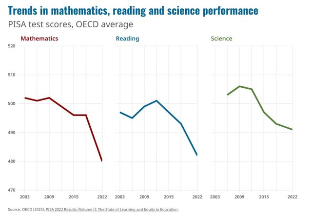

# Intro

**PrimaSTEM** - Solution d'apprentissage pour les enfants dès 4 ans qui enseigne les mathématiques, la logique algorithmique et la base de la programmation sans écran.

*Le panneau de contrôle interprète les jetons d'instructions. Le robot exécute le code et peut dessiner le résultat.*

- 📊 [Présentation pour B2B](https://pitch.com/v/primastem_b2b_fr-w5yrm2)

## Qu'est-ce qui se passe?

**Les enfants d'aujourd'hui** s'intéressent dès leur plus jeune âge aux jeux vidéo et aux appareils électroniques, et ils les **maîtrisent rapidement**.

De nombreux parents comprennent l'**importance de la technologie de l'information** pour le succès scolaire de leurs enfants et pour accéder à des carrières recherchées à l'avenir.

Cependant, **les parents s'inquiètent** de l'équilibre entre l'apprentissage de leurs **enfants** et leur **santé**.

Ces dernières années, une **exposition précoce aux écrans** a été associée à une **diminution des capacités** cognitives et à de moins bonnes performances scolaires.

** *Programme pour le Suivi International des Acquis des élèves (PISA) [2022 Results (Volume I)](https://www.oecd-ilibrary.org/education/pisa-2022-results-volume-i_53f23881-en)*

L'emploi **d'appareils avec écrans** pour les jeux et l'apprentissage des jeunes enfants **entraîne** :

- des troubles psychologiques,
- une dépendance au monde virtuel - l'addiction aux jeux,
- une détérioration de la vision et de la santé physique.

## À quoi cela sert-il?

Un **outil pédagogique et ludique pour enseigner aux enfants** à partir de 4 ans les mathématiques, la logique algorithmique et la base de la programmation **sans écran**.

En d'autres termes, il s'agit d'un outil destiné à l'enseignement de concepts tels que:
- les nombres
- la direction dans l'espace
- les algorithmes
- la logique
- les bases de programmation
- les opérations arithmétiques et progressions
- la géométrie

**Avantages :**

- polyvalence, universalité pédagogique
- ludique pour apprendre aux enfants en s'amusant
- sans danger pour la santé (pas d'écran)
- à partir de 4 ans et jusqu'à l'école primaire
- l'ensemble utilise des matériaux naturels
- solution technique innovante basée sur la technologie NFC et Bluetooth

> 🎯 **L'objectif principal** de cet apprentissage est de développer les capacités cognitives grâce à la matérialisation et à la représentation visuelle des processus de programmation, en mettant l'accent sur la compréhension et l'interprétation de leurs résultats.

## Comment ça fonctionne?

?> Vous devez allumer et tout fonctionne déjà! Pas de connexions et de paramètres!

**Avec cette présentation de 6 minutes, vous pouvez découvrir les fonctionnalités de PrimaSTEM** *(Sous-titres en anglais et français disponibles)* - [youtu.be/Ztq_I1WBiVo](https://youtu.be/Ztq_I1WBiVo)

<iframe src="https://www.youtube.com/embed/Ztq_I1WBiVo?si=ZNSLpsCC8WlPB671" width=100% height="315" title="YouTube video player" frameborder="0" allow="accelerometer; autoplay; clipboard-write; encrypted-media; gyroscope; picture-in-picture; web-share" referrerpolicy="strict-origin-when-cross-origin" allowfullscreen></iframe>

Un exemple utilisant un changement de variable et des nombres négatifs. - [youtu.be/6Zoyku27mO8](https://youtu.be/6Zoyku27mO8)

<iframe src="https://www.youtube.com/embed/6Zoyku27mO8?si=WYYMKyV7d768DI-D" width=100% height="315" title="YouTube video player" frameborder="0" allow="accelerometer; autoplay; clipboard-write; encrypted-media; gyroscope; picture-in-picture; web-share" referrerpolicy="strict-origin-when-cross-origin" allowfullscreen></iframe>

Un exemple d'un dessin de cœur. - [youtu.be/VgiWu200EGw](https://youtu.be/VgiWu200EGw)

<iframe src="https://www.youtube.com/embed/VgiWu200EGw?si=EiQKbP0egmZ2aXCa" width=100% height="315" title="YouTube video player" frameborder="0" allow="accelerometer; autoplay; clipboard-write; encrypted-media; gyroscope; picture-in-picture; web-share" referrerpolicy="strict-origin-when-cross-origin" allowfullscreen></iframe>

> 📺  Voir plus de vidéos sur la chaîne **YouTube** ici -  [youtube.com/@primastem](https://www.youtube.com/@primastem)

## Pour qui est-ce?

Il est clair qu'il est destiné aux enfants. Ils l'utilisent pour jouer, mais il s'agit en fait d'un outil flexible pour l'enseignant, qui permet, à travers les tâches du jeu, d'enseigner une variété de sujets : des mathématiques et de la programmation à la physique, l'histoire, la géographie, et n'est limité que par la compétence et l'imagination de l'enseignant.

L'enfant acquiert une base mathématique et algorithmique, c'est une préparation à l'école et la première étape avant de maîtriser la programmation Scratch, Logo ou Minecraft sur l'ordinateur.

## L'avis de nos Partenaires.

|Violaine Locus|Ludovic Augustin|Béatrice Saslawsky|Delphine Vandeweghe|
|:-:|:-:|:-:|:----------:|
|Professeur des écoles|Professeur de Technologie|Professeur des écoles|Professeur en ecole spécialisé|
|[Ecole élémentaire Bocca Muriers](https://www.education.gouv.fr/annuaire/06150/cannes/ecole/0060769d/ecole-elementaire-bocca-muriers.html)| |[Ecole élémentaire Bocca Muriers](https://www.education.gouv.fr/annuaire/06150/cannes/ecole/0060769d/ecole-elementaire-bocca-muriers.html)| |
| "PrimaSTEM peut nous aider à éveiller les enfants aux mathématiques tout en s'amusant." | "Super ludique pour l'apprentissage sans écran, un vrai plus pédagogique." | "Je suis convaincu que nous pouvons aller plus loin dans l'enseignement grace à cet outil." | "PrimaSTEM peut aider les enfants des écoles spécialisées en occupant leur esprit différemment. La visualisation, l'interprétation et le côté ludique sont un vrai atout pour ces enfants." |

*Exemple de résultat de l'exécution d'un programme de dessin d'une spirale utilisant l'incrémentation dynamique de variables dans une boucle.*

## Et maintenant?

**PrimaSTEM est notre tentative de créer quelque chose dont les enseignants ont besoin, qui soit flexible et intuitif.**

Nous recherchons actuellement des partenaires pour lancer le projet en France et nous nous efforçons d'attirer des investissements, d'ouvrir un bureau et de produire dans l'UE. Nous sommes prêts pour la coopération et le partenariat.

