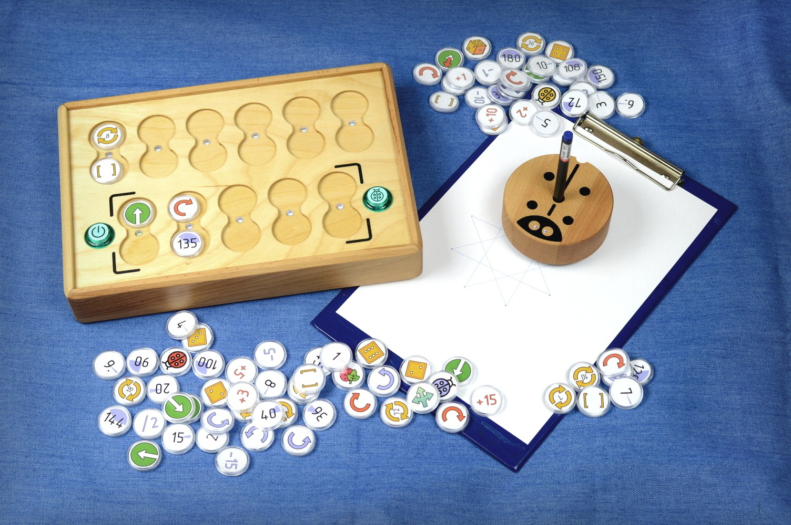
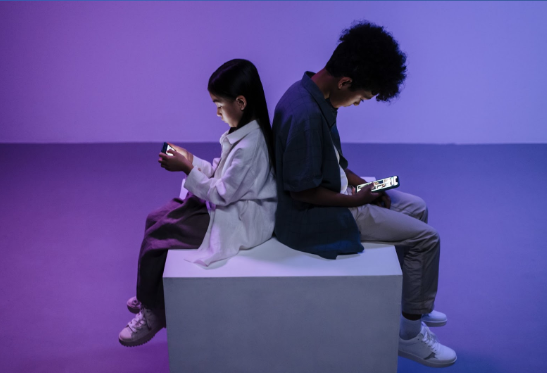
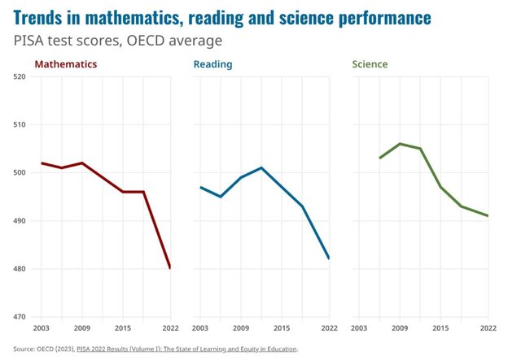
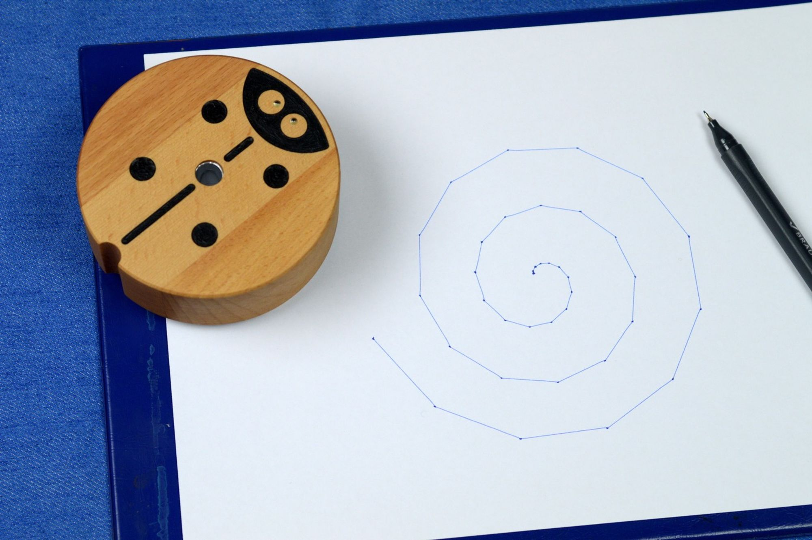

# Introduction

**PrimaSTEM** - A tool to teach children 4+ the basics of programming, logic and math without the use of screen-based devices.

*Control panel for program creation, program blocks, robot and code execution results.*

- 📊 [Presentation for B2B, French language](https://pitch.com/v/primastem_b2b_fr-w5yrm2)

## What's going on?

**Modern children** are interested in video games and electronic devices from an early age and are **fast learners**.

Most parents understand the **importance of information technology** to their children's success in school and future careers.

However, **parents are concerned** about the balance between **children's** learning and their **health**.

In recent years, early exposure to screens has been associated with declines in cognitive ability and school performance. **

** *International Student Assessment Program(PISA) [2022 Results (Volume I)](https://www.oecd-ilibrary.org/education/pisa-2022-results-volume-i_53f23881-en)*

The use of **screen devices** for play and learning for young children **causes**

- psychological disorders,
- addiction to the virtual world-gaming addiction,
- visual and physical impairment.

## What's it for?

This is a playful teacher's **tool for teaching children** ages 4 and up the basics of programming, logic and math **without the use of electronic devices with screens**.

Simply put, it is a tool to teach children the concepts of numbers, angles, algorithms, logic, basic programming, arithmetic operations, negative and random numbers, progressions, and geometry in a fun and visual way.

**Benefits:**

- versatile, all-in-one learning
- engaging learning experience for children
- no screens or electronic devices
- from age 4 up to and including elementary school
- natural materials for the casing
- innovative technical solution based on NFC technology

> 🎯 **The primary learning objective** is to develop cognitive skills by materializing and visualizing programming processes and understanding the meaning of their outcomes.

## How does it work?

**This short video is a 6 minute presentation** *(there are Russian subtitles)*, it will go fast and interesting, everything will move, draw and talk about functionality - [youtu.be/Ztq_I1WBiVo](https://youtu.be/Ztq_I1WBiVo)

<iframe src="https://www.youtube.com/embed/Ztq_I1WBiVo?si=ZNSLpsCC8WlPB671" width=100% height="315" title="YouTube video player" frameborder="0" allow="accelerometer; autoplay; clipboard-write; encrypted-media; gyroscope; picture-in-picture; web-share" referrerpolicy="strict-origin-when-cross-origin" allowfullscreen></iframe>

Math drawing using variable and negative numbers. - [youtu.be/6Zoyku27mO8](https://youtu.be/6Zoyku27mO8) 

<iframe src="https://www.youtube.com/embed/6Zoyku27mO8?si=WYYMKyV7d768DI-D" width=100% height="315" title="YouTube video player" frameborder="0" allow="accelerometer; autoplay; clipboard-write; encrypted-media; gyroscope; picture-in-picture; web-share" referrerpolicy="strict-origin-when-cross-origin" allowfullscreen></iframe>

A mathematical drawing of the heart. - [youtu.be/VgiWu200EGw](https://youtu.be/VgiWu200EGw) 

<iframe src="https://www.youtube.com/embed/VgiWu200EGw?si=EiQKbP0egmZ2aXCa" width=100% height="315" title="YouTube video player" frameborder="0" allow="accelerometer; autoplay; clipboard-write; encrypted-media; gyroscope; picture-in-picture; web-share" referrerpolicy="strict-origin-when-cross-origin" allowfullscreen></iframe>

> 📺  More videos on the channel **YouTube** -  [youtube.com/@primastem](https://www.youtube.com/@primastem)

## Who's it for?

Of course it's clearly meant for kids, they use it to play, but it's actually a flexible tool for the teacher who can use game assignments to teach a wide variety of subjects, from math and programming to physics, history and geography, all limited only by the skill and imagination of the teacher.

The child acquires a mathematical and algorithmic base that is a preparation for school and the first step before mastering computer programming in Scratch, Logo or Minecraft.

*Example of program execution result for drawing a spiral using dynamic increase of variables in a loop.*

## What's next?

**PrimaSTEM is our attempt to create something people need, tangible and beautiful.**

Now we are looking for partners to launch the project in France and are working on attracting investment, opening an office and production in the EU. We are ready for cooperation and partnership.
