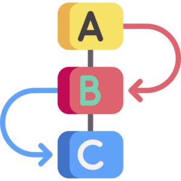
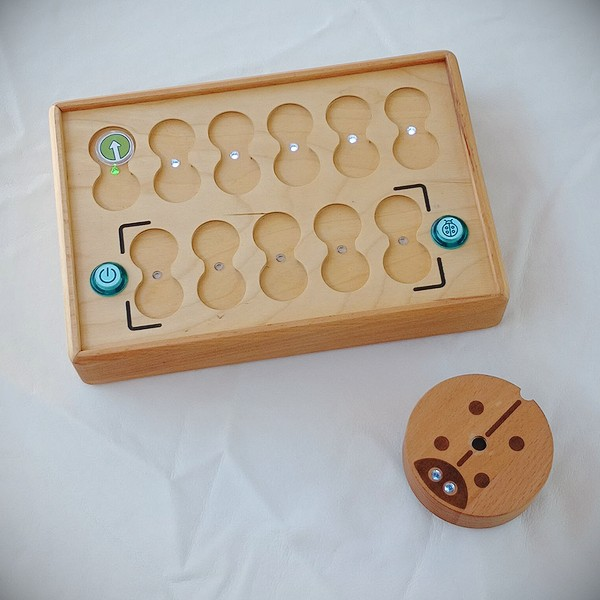
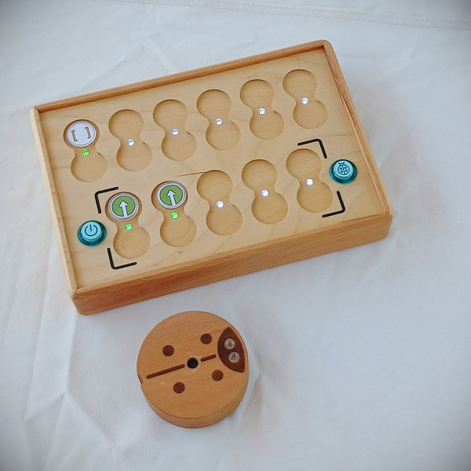

# Teacher’s Guide

We, the creators of PrimaSTEM, introduce you to an educational kit for developing logic, programming, and mathematics skills through play.

PrimaSTEM is a toy and teaching aid that allows children aged 4-10 to learn programming by controlling a friendly robot without computers, tablets, or phones.

The complex process of programming is simplified here into a tangible, tactile form, making it accessible even to the youngest children. Children learn the basics of programming, logic, and mathematics through play.

PrimaSTEM can be used in various preschool and school subjects, such as mathematics and geography, as well as in extracurricular developmental activities. It is versatile!

Playing with PrimaSTEM promotes the development of children in key areas such as logical thinking, algorithmics, programming, mathematics, geometry, and creative and socio-emotional growth.

The PrimaSTEM kit serves as a preparatory step for introducing children to programming on computers using block-based languages like [Scratch](https://en.wikipedia.org/wiki/Scratch_(programming_language)) or [LOGO](https://en.wikipedia.org/wiki/Logo_(programming_language)).

## Introduction to the Learning Kit

### How and Where Can PrimaSTEM Be Used?

Below are educational areas and programs where PrimaSTEM can be used to teach children the basics of logical thinking and programming, as well as studying other subjects through tactile gameplay:

- Preschool learning centers
- Montessori kindergartens
- Elementary schools
- Homeschooling
- Special education centers for children with developmental differences
- After-school programs
- Introductory programming clubs
- Educational summer camps for children

### What Do You Need to Know to Start Teaching?

Before using the kit with children, we recommend that teachers read the user manual. No special programming skills are required to teach with PrimaSTEM. This guide provides the basics necessary to get started.

## Research and Value of the Kit

The inspiration for PrimaSTEM came from the [LOGO](https://en.wikipedia.org/wiki/Logo_(programming_language)) programming language, developed by [Seymour Papert](https://en.wikipedia.org/wiki/Seymour_Papert) in the 1960s, and the Montessori pedagogy. The LOGO language and its turtle robot provided children with an accessible introduction to programming, allowing them to discover their unique problem-solving methods.

The **command chips** of PrimaSTEM simplify this approach. The tactile interface, which does not require screens or text, makes learning more intuitive for young children.

By observing the robot’s behavior, one can easily grasp the meaning of each command, thus mastering not only programming tools but also basic algorithms.

The robot has an essential quality: it has a direction, allowing children to identify with it and better understand the fundamental logic of programming.

The initial commands are very simple: they specify the exact direction in which the robot should move. Teaching the robot to “act” or “think” encourages children to reflect on their own actions and thoughts, making the learning process more effective.

The PrimaSTEM command chips can be considered a simplified version of the LOGO language. We have limited the basic instructions to their simplest form, avoiding any textual or numeric language at the start of learning.

### Why Natural Materials?

The choice of wood for the control panel and robot is significant. Observations in kindergartens showed that children prefer wooden toys, which are more pleasant to handle and develop a unique character over time, creating a sense of history.

## Programming Concepts with PrimaSTEM

The physical, tangible PrimaSTEM command chips correspond to the elements of any real procedural programming language. Through play, children can learn various fundamental concepts of programming and logic.

### Algorithms

**Algorithms** are sets of precise instructions that form a program. PrimaSTEM command chips represent physical instructions that are combined to create a program.

### Sequence

Instructions in programs are executed in a specific order, one after another. On the PrimaSTEM control panel, they are arranged sequentially from left to right, providing a physical representation of a sequence.

### Debugging Errors

Instructions are arranged one after another on the control panel. Fixing errors is as simple as swapping a chip if the robot does not reach its intended destination. This is known as debugging a program.

### Functions

A function (or subprogram) in programming is a fragment of code that can be called from another part of the program. You can create a subprogram by "packing" a sequence of instructions in the function row (lower section of the control panel) and calling it in the main queue using the orange “**Function**” chip (in the upper section of the panel) whenever needed.

## Applications for Teaching Other Subjects

PrimaSTEM is not limited to programming; it can also be used for teaching other subjects and skills:

- **Communication**: Group play encourages cooperation and mutual assistance.
- **Coordination and Motor Skills**: Manipulating the chips and interacting with the robot helps improve coordination and fine motor skills.
- **Socio-Emotional Development**: Children build confidence as they try new activities and solve problems together.
- **Mathematics**: PrimaSTEM reinforces basic mathematical concepts such as counting, distance, probability, arithmetic, and geometry.
- **Logical Thinking**: Programming the robot helps children develop sequencing skills and anticipate actions.

!> A child, given a task or inventing their own plan, builds a sequential chain of command chips tactilely. After pressing the “**Execute**” button, the robot starts moving, and the child sees the results of their program code. They draw conclusions about whether they directed the robot correctly and whether the result matches their initial thought. This process simultaneously engages the child's tactile, visual, and mental perception in the game-learning experience.

## Getting to Know the Robot and Control Panel

### The Robot

Introduce the robot to children as a friend they can program. Explain that the robot cannot think for itself and needs their instructions to move. This helps children understand that the robot, like other household devices (e.g., TVs, washing machines), requires human input to operate.

### The Control Panel

Explain that the control panel is used to send commands to the robot. Without it, the robot cannot move. Show children how to insert chips and use commands to program the robot.

> The main part of the program for the robot is created using only the top row of the control panel (6 command slots and the value slots below them). The lower section of the panel (5 command slots and value slots below them) is for subprograms and is activated when the “**Function**” command is used.

### Introducing Command Chips

Chips are instructions for the robot inserted into the control panel. After pressing the button, the robot executes the program. Each chip represents a distinct and clear command, helping children develop computational thinking skills. It is essential for children to understand what the robot does when each command is activated. This teaches them to design programs and predict the robot’s actions. Also, explain to children that the chips should not be lost, damaged, or wet, as the robot cannot execute commands correctly without them.

## Gameplay - Part 1 (Beginner Level)

### Cause and Effect

The goal of the first lesson is to introduce the simple concept that sending a command to the robot causes an action. Take the green chip (“Forward”) and ask the child to place it in the first top-left slot of the control panel. Then, have the child press the large button on the panel (“Execute”) and observe the robot executing the command. Make sure the child clearly associates the chip's appearance with the action performed.

### Clear Instructions

Repeat the previous step with each directional chip: forward, left turn, and right turn, until the child can confidently recognize each chip as a distinct and clear instruction for the robot. This is an important step toward understanding how meaningful sequences of commands can later be created to solve specific tasks.

### First Task

Lay out a grid (or create a 10x10 cm grid on a flat surface using tape or markers) and place the robot on a square.

Ask the child to create a program that moves the robot to the square directly in front of it. The child should reason and state which single instruction will allow the robot to reach its goal. Let the child insert the chip into the first top slot of the panel and press the “Execute” button.

If the wrong chip is chosen, simply return the robot to its starting position and encourage the child to think about their choice and try different options.

## Gameplay - Part 2 (Beginner Level)

### Sequence of Events

This time, place the target two squares ahead of the robot, then ask the child to create a program with two chips that will guide the robot to its home. Encourage the child to think and build a sequence that leads the robot to its destination.

Have the child insert the chips into the first two top slots of the control panel and press the “**Execute**” button. If the wrong chip is chosen, simply return the robot to its starting position and encourage the child to think about their choice and try different options.

### Three-Chip Command Sequence

This time, place the target one square ahead and one square to the right (or left) of the robot. Ask the child to create a program that guides the robot to its home. Encourage the child to think and create a sequence that leads the robot to the destination.

Have the child insert the chips into the first three top slots of the control panel and press the “**Execute**” button. If the wrong chip is chosen, simply return the robot to its starting position and encourage the child to think about their choice and try different options.

### Debugging - Finding Errors

Place the target one square ahead and one square to the left (or right) of the robot.

This time, create a program to solve the problem, intentionally inserting an incorrect turn into the sequence.

Ask the child to predict the incorrect command in the program and foresee the wrong result. Allow them to press the “**Execute**” button to confirm their prediction.

After the child verifies that the presented sequence was incorrect, either through reasoning or testing, allow them to replace the incorrect command with the correct one, thus debugging the program.

## Gameplay - Part 3 (Intermediate Level)

### Introducing the "Function" Command

After the child becomes familiar with basic commands and the concept of an algorithm, it’s time to introduce the function command chip. A function in programming is a reusable piece of code that can be called from another part of the program.

To explain how it works, you can use the metaphor of a "tower" (where additional commands are stacked under the function chip), illustrating that you can place more instructions within one orange "Function" chip.

To demonstrate this, first place two green "**Forward**" chips in the main top slots of the control panel and press the “**Execute**” button. This moves the robot forward by two grid squares.

Now clear the control panel slots and place two "**Forward**" chips in the function row of the panel (lower slots). Then place a “Function” chip in the main upper slot. Have the children observe that the robot can perform the same actions with two different sequences.

Next, create a program for the robot: **“Forward”-“Forward”-“Right”-“Forward”-“Forward”**. Show the children how the robot executes this sequence. Then ask them to identify repeating parts in the program.

Ask whether these repeating parts can be "hidden" inside a “**Function**” to avoid duplication.

Work with the children to create a program using the “Function” command: place **“Function”-“Right”-“Function”** in the top section of the control panel, and in the function section (lower panel row), place **“Forward”-“Forward”**.

Observe the results with the children, highlight the repeating parts of the program, and try modifying the robot’s actions using the “**Function**” command.

### Solving Problems with the “Function”

Lay out the grid, place the robot on the start square, and give the child only the following chips: 3 “**Forward**” chips and 2 “**Function**” chips.

Ask the child to create a program that moves the robot forward by five squares. Since there aren’t enough “**Forward**” chips for the task, the child must understand that the solution requires using a helper function, which we call simply a “**Function**.”

Encourage the child to build the correct sequence, including the function, and press the “**Execute**” button. If the sequence is incorrect, simply return the robot to its starting position and ask the child to reason through the correct solution and try new options.

## Gameplay - Part 4 (Advanced Level)

### Introducing the "Random Movement" Command

To introduce the concept of randomness, take 3 directional chips: “**Forward**,” “**Left**,” and “**Right**.” Place them in an opaque box or bag, shuffle them, and ask the children to draw one chip at a time and show it to the group before returning it to the bag. Explain the idea of randomness with three states using this example.

Then show the children the “**Random Movement**” command chip, which replicates the pictograms of all three directional chips.

Explain that this chip does what they were doing earlier—randomly selecting one of the three directional commands—and then moves the robot one logical step (grid square).

Place the “**Random Movement**” chip in the top slot of the control panel and press the “Execute” button. Return the robot to its starting position and repeat the exercise several times.

Play a small game called “What will the robot do?” Ask the child to guess whether the robot will move forward, turn left, or turn right before pressing the “**Execute**” button.

Emphasize that this is randomness, and it is impossible to predict the exact direction every time.

## Gameplay - Part 5 (Advanced Level)

### Introducing Command Parameters - Numerical Loops

Until this point, the slots below the command slots have not been used. Now it’s time to introduce them. Show the children the value chips, ask if they recognize the numbers, and if they’ve seen dice used in board games.

Place two “**Forward**” chips in the upper slots of the control panel and press the “**Execute**” button. The robot will move two squares.

Remove one of the chips, place a loop chip with the numeric value 2 (a chip with two dots) under the remaining command, and press the “**Execute**” button.

Emphasize to the children that the loop chip with 2 dots replaced repeated commands in the sequence, effectively creating a repeat (loop).

Set up 3, then 4 “**Forward**” commands, press the “**Execute**” button, and then ask the children to replicate the robot’s movement over 4 squares using the value chips. Solutions can range from straightforward ones like setting the “**Forward**” chip with a loop value of 4 to more complex variations, such as “**Forward**” with a loop value of 3 followed by another “**Forward**” command, and so on.

### Looping a “Function” Multiple Times

Try applying a loop with values to the “Function” command, for instance, making the robot move in a zigzag by setting the “Function” command with a loop value of 5 and programming the function sequence in the lower panel slots as **“Forward,” “Right,” “Forward,” “Left.”**

First, create a step program using the function and execute it.

Then add a loop chip with the number 5 to the function, repeating it multiple times.

After pressing the “**Execute**” button, the robot will zigzag diagonally to the right and upwards, making 5 steps along the way. Explain to the children that repeating a “**Function**” multiple times in a program is called a function loop and is used to repeat a specific sequence of commands in a program several times.

## Gameplay - Part 6 (Advanced Level)

### Introducing the Concept of Random Numbers

Similar to “**Random Movement**,” there is a loop chip called “**Random Number of Loops**,” represented by a dice symbol. This chip can take random values from 1 to 6, corresponding to the numeric loop chips.

To introduce the concept of random numbers, take 4 value chips: “**2**,” “**3**,” “**4**,” and “**5**.” Place them in an opaque box or bag, shuffle them, and ask the children to draw one chip at a time, show it to the class, and announce its value before returning it to the bag. Play a game to see who draws the highest value. Use this example to explain randomness among four states.

Next, show the children the “**Random Number of Loops**” value chip. Explain that this chip acts similarly to their earlier activity of drawing random value chips from a bag—it randomly selects a number between 1 and 6 to pass to the robot for repeating actions.

Place a “**Forward**” chip in the top slot of the control panel and the “**Random Number of Loops**” chip below it. Ask the children to press the “**Execute**” button. Return the robot to its starting position and repeat the exercise several times.

Play a small game by dividing the children into two teams: “Whose robot will go farther?”

Draw attention to the fact that the robot moves a random number of squares, between 1 and 6. Emphasize that this is randomness, and it’s impossible to predict the exact distance the robot will travel.

## Encourage Creativity with the Children!

Only you know your students best and how to work with them. The development and education of children depend entirely on you. PrimaSTEM is a universal tool for teaching children not only logic and programming but also other subjects in a playful manner. Use its flexibility and versatility to create engaging learning environments. It’s all up to your imagination!

> Thank you for using PrimaSTEM in your teaching process or for showing interest in the kit!

We highly value feedback and reviews. Please share your experience with us.
