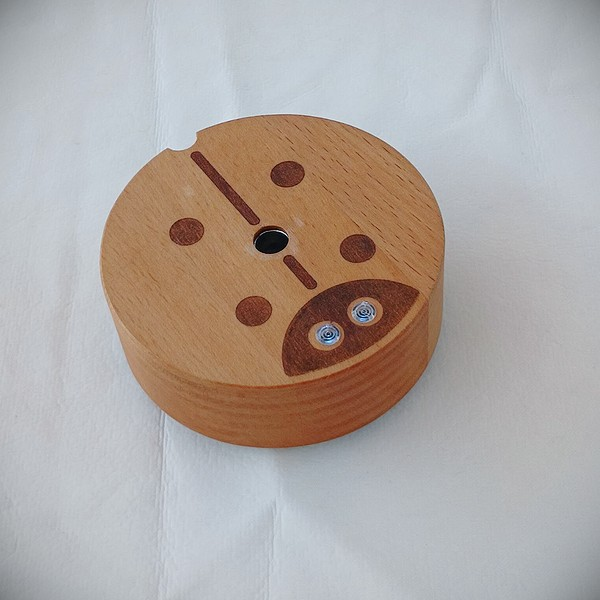
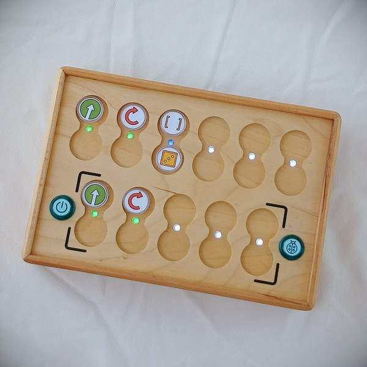

# User Manual

**PrimaSTEM** - A set for teaching children aged 4+ the basics of logic, programming, and mathematics.

## What’s included in the set?

- Play robot

- Robot control panel

- Command and value chips

- USB charger 2xUSB - 2A with two USB-C cables

- User manual and teacher guide (via link at primastem.com)

- Game board

> Variants in design and additional equipment may vary.

### Play Robot

The robot's appearance may slightly vary depending on the configuration, but its main functionality remains unchanged: the robot executes commands transmitted from the control panel, moving across a horizontal surface.

A marker with a diameter of less than 10 mm can be placed in the center of the robot, allowing it to draw simple geometric shapes while moving.

The robot has a power button, indicator LEDs, a control button, and a USB-C port for charging the built-in battery.

### Control Panel

The control panel is the main part of the hardware set. The top panel contains 11 paired slots for inserting command and value chips, 6 in the upper section and 5 in the lower section. The panel is divided into two functional parts: the upper part for the main program slots and the lower part for subprograms (functions).

The control panel has two buttons: the power button on the left and the “Execute / Stop” button on the right for transmitting the program to the play robot and stopping the program during execution.

After placing the NFC command and value chips into the slots of the panel, pressing the “Execute” button starts the robot executing the program. Execution of the current commands is highlighted by multicolored LEDs located between the slots.

If a chip is incorrectly placed, the panel will indicate this with a red LED, but the program will continue execution, ignoring the erroneous command (e.g., when placing a numeric value chip without a primary command).

The control panel includes a USB-C port for charging its built-in battery.

### Command and Value Chips

The set includes chips for creating programs, which are elements of the program code inserted into the panel slots. Each chip is a command, carrying a strictly defined value (instruction). By arranging the blocks in a specific sequence, you instruct the robot to move exactly as you planned.

> Chips are divided into command chips and value chips:

#### Command Chips

Command chips are the basic building blocks for creating a robot control program.

- **“Forward”** - moves forward (10 cm by default, without setting a numeric value).

- **“Right”** - turns (90 degrees clockwise by default, without setting a numeric value).

- **“Left”** - turns (90 degrees counterclockwise by default, without setting a numeric value).

- **“Function”** - executes the subprogram set in the lower section of the panel.

- **“Random Movement”** - randomly moves the robot 1 logical step “Forward,” “Left,” or “Right” (default distance without setting a numeric value).

- **“Backward”** - moves backward (10 cm by default, without setting a numeric value).

#### Repeat (Loops) Chips and Value Chips

In addition to command chips, repeat (loop) and numeric value chips extend functionality by allowing commands to be executed multiple times or expanding command functionality—for instance, making a turn at an angle other than 90 degrees or altering the forward movement distance.

Repeat chips represent values from 2 to 6 (indicated by the number of dots on the chips), as well as pictogram loops with numeric values inside.

The “Dice” chip signifies a random number of repeats: when placed, a random number from 1 to 6 is selected.

Angle and distance chips are available with primary angles of 30, 36, and 45 degrees and their multiples (e.g., 60, 72). Angles are measured in degrees, and distances in millimeters. By default, the angle is 90 degrees, and the forward movement distance is 100 mm (10 cm).

## Connecting the Panel and Robot

To connect the panel and robot, it is recommended to first turn on the robot and then the panel.

After turning on the robot, place it on a horizontal surface and avoid moving it until it connects with the panel—indicated by white LEDs on both devices (at this moment, gyroscope calibration for straight movement and precise turns occurs).

If the panel and robot are not connected, red LEDs will blink on both devices.

Ensure the panel and robot “hear” each other by placing any movement chip (e.g., “Forward”) in the top row of the panel and pressing the “Execute” button.

If connection issues persist, try restarting the robot and panel or recharging the batteries. Close contact with strong electromagnetic devices (e.g., mobile phones or Wi-Fi access points) may interfere with the connection.

!> After firmware updates, the **panel and robot may require pairing**. To pair, turn on the robot, then the panel, and press and hold the “Execute” button on the panel for 10-15 seconds.

## How It Works?

Children insert command chips (e.g., forward, left, right, function, random movement, etc.) into the panel slots, each representing an action for the robot. Additionally, they can set numeric values for commands and the number of command repetitions (from 2 to 6, random numbers, or values for angles, distances, arithmetic operations).

The slots for placing command-value chip blocks are intuitively grouped with a “bridge” containing an indicator LED.

Commands are primarily inserted into the upper section of the panel (6 slots) and executed step-by-step from left to right, ignoring empty slots or incorrectly placed commands (e.g., two control commands in one block or two value commands).

The sequence of block placement determines the robot’s movement program.

Once the command and value blocks are arranged, pressing the “**Execute**” button on the panel starts the robot moving along the programmed path.

By default, the "**Forward**" command moves the robot 10 centimeters, and the "**Left**" and "**Right**" commands turn the robot 90 degrees in the desired direction. Adding repeat (loop) chips to functional commands enables multiple repetitions of a command.

Using the "**Function**" chip initiates the execution of the subprogram set in the lower section of the panel (5 lower slots).

The panel also supports program loops—calling a subprogram multiple times by adding a repeat (loop) chip to the “**Function**” command chip.

**Key Functions:**

- Program execution can be interrupted at any time by pressing the “Execute” button again while the robot is moving.

- The panel remembers the last numeric value set for movement commands (distance or turn angle) until it is turned off. For example, if the “Forward” command is set to a value of 150, all other “Forward” commands in the program will also execute with a value of 150 (150 mm = 15 cm). This feature can be used to change the default step size for game boards with cells not equal to 10 cm. Numeric changes via arithmetic operation chips also retain their results.

- The default movement distance (for use with boards with cells of 12.5 cm, 15 cm, or any other size) can be changed using the special “Distance” service chip. To change the default movement distance, insert the “Distance” chip along with the required numeric value, e.g., 125 for 12.5 cm or 150 for 15 cm (without a numeric value, the distance defaults to 10 cm). The set value persists even after the device is turned off.

- After updating the device firmware, gyroscope calibration and default movement distance calibration may be required for the robot:
  - a. To calibrate the gyroscope, turn on the robot and place it on a flat surface. Insert the special “Calibration” service chip into the panel and press the “Execute” button.
  - b. To calibrate the distance, measure the actual distance traveled by the robot using the “Forward” command (it is typically slightly more or less than 100 mm). Insert the “Calibration” chip into the panel, along with a numeric chip with the closest measured value, and press the “Execute” button. You can also write the exact value to any numeric NFC chip using a mobile phone, as text in the format nXXX, where XXX is the value in millimeters (e.g., n095). After executing the “Calibration” command with this value, the robot will move precisely 100 mm.

?> Detailed information about extended functionality can be found in the Teacher’s Guide.

## Important!

Please note that this set is not suitable for children under 4 years old. It contains small parts that pose a choking hazard. Activation, setup, and indoor use should be supervised by adults.

The toy uses Li-ion batteries. Batteries should only be charged under adult supervision using a standard USB 5V output and USB-C cable.

Batteries should be charged either 1-2 hours before the lesson or after the lesson. A 1-hour charge for the panel and robot typically lasts for 1-2 lessons, while a full charge (2-3 hours) lasts for 3 lessons of 30-45 minutes each. Battery capacity and runtime may decrease over time, and replacement may be necessary with standard 16340 Li-ion batteries.

The panel and robot automatically turn off after 10 minutes of inactivity to conserve battery power.

After 1 to 3 minutes of inactivity, the robot makes small movements and turns to indicate it is operational and ready to execute a program.

Do not attempt to open the panel or robot. For repairs or battery replacement, contact the seller for advice or service.

If the set is not used for a prolonged period, charge the batteries every 2-3 months. Critically low battery levels can render the batteries unusable, necessitating replacement.

The set is intended for use and storage in dry, warm environments with heating and ventilation, at a temperature range of +10°C to +30°C and relative humidity of 45–60%. It should be kept away from direct sunlight, atmospheric precipitation, wind, sand, and outdoor dust. Exposure to moisture should also be avoided.

The panel and robot should be protected from falls, impacts, and excessive vibration.

Transport and storage of the set should be done in the manufacturer’s packaging at an ambient temperature of +5°C to +40°C, ensuring precautions against mechanical damage and exposure to atmospheric precipitation.

The PrimaSTEM set offers a practical and interactive approach to learning, introducing children to programming concepts while fostering their creativity and logical thinking skills.
