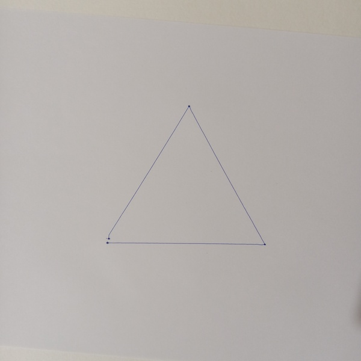
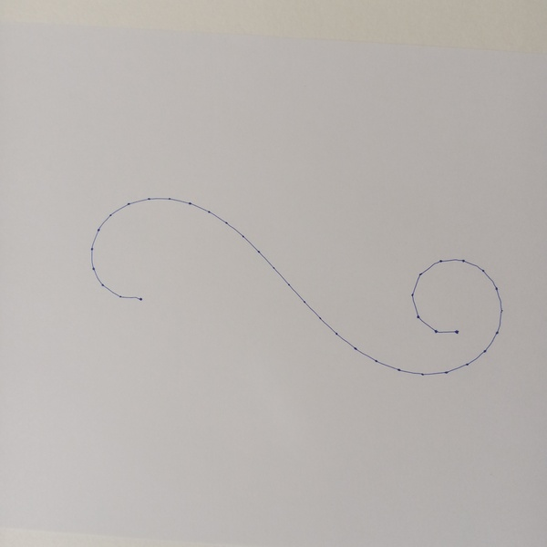
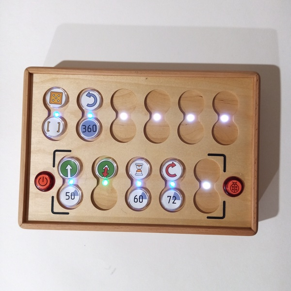
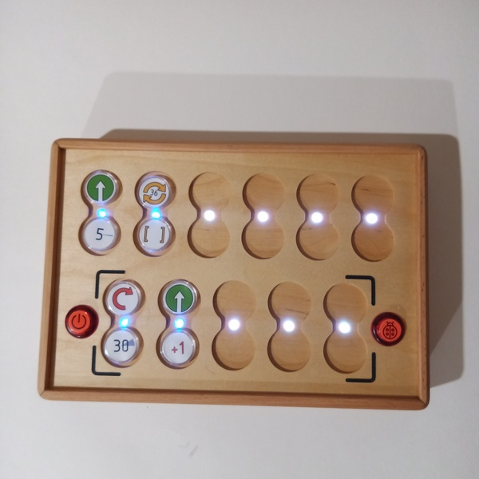

# Exemples de dessins mathématiques

## Une simple étoile à dix branches

| Code | Résultat |
| --- | --- |
|  |  |

## Un pentagone droit

| Code | Résultat |
| --- | --- |
|  |  |

## Une simple étoile à cinq branches

| Code | Résultat |
| --- | --- |
|  |  |

## Dessin mathématique du cœur

| Code | Résultat |
| --- | --- |
|  |  |

## Triangle avec un programme simple

| Code | Résultat |
| --- | --- |
|  |  |

## Triangle utilisant la fonction

| Code | Résultat |
| --- | --- |
|  |  |

## Spirale triangulaire

| Code | Résultat |
| --- | --- |
|  |  |

## Courbe à angles négatifs

| Code | Résultat |
| --- | --- |
|  |  |

## Spirale carrée

| Code | Résultat |
| --- | --- |
|  |  |

## Minuterie de ~5 minutes

| Code | Résultat |
| --- | --- |
|  |  |

## Minuterie de ~1 minute

| Code | Résultat |
| --- | --- |
|  | Le robot effectue une rotation de 36 degrés, 10 fois toutes les 6 secondes, et à la fin, il effectue une rotation de 360 degrés. |

## Spirale

| Code | Résultat |
| --- | --- |
|  |  |