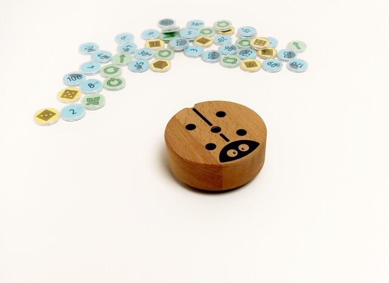
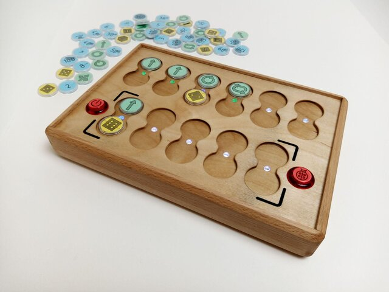
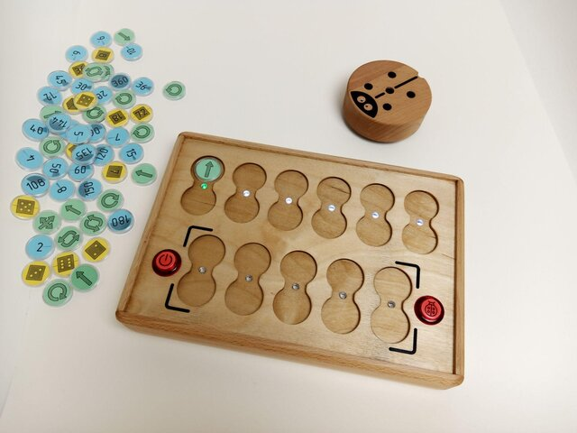
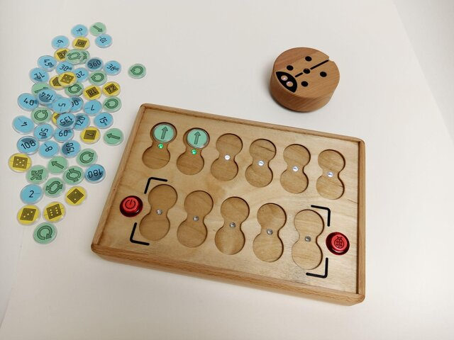
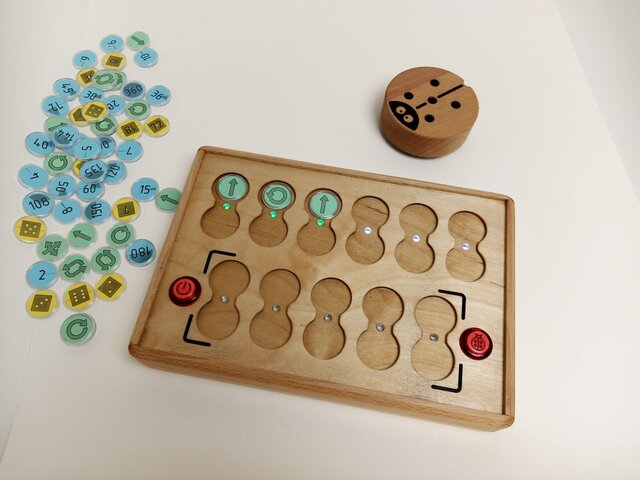
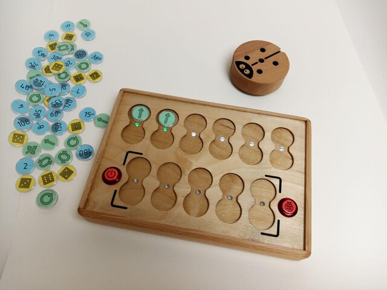
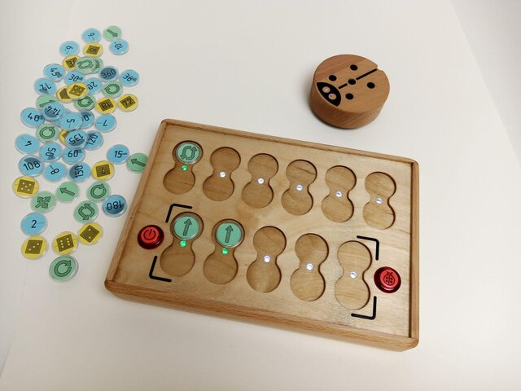
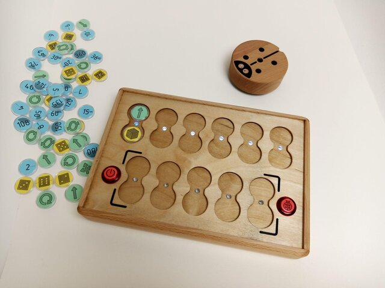

# Guide de l'enseignant 1

> Niveau élémentaire

Nous, les créateurs de PrimaSTEM, vous présentons un kit éducatif en développement pour jouer à des jeux et enseigner la logique, la programmation et les mathématiques.

PrimaSTEM est un jouet qui permet aux enfants âgés de 4 à 10 ans d'apprendre à programmer un robot sympathique sans ordinateur, tablette ou téléphone.

Le processus de programmation complexe est présenté ici de manière simple et tactile, accessible même aux plus jeunes.  Les enfants comprendront les bases de la programmation, de la logique et des mathématiques en jouant.

PrimaSTEM peut être utilisé dans diverses matières préscolaires et scolaires, telles que les mathématiques, la géographie et les activités de développement extrascolaires. Il est universel !

Jouer avec PrimaSTEM favorise le développement des enfants dans des domaines clés tels que la pensée logique, les algorithmes, la programmation, les mathématiques, la géométrie, ainsi que le développement créatif et socio-affectif.

PrimaSTEM est la première étape préparatoire avant d'initier les enfants à la programmation informatique dans des langages blocs tels que Scratch ou LOGO.

## Familiarisation avec le kit de formation

### Où puis-je utiliser le kit PrimaSTEM?

Il s'agit de domaines et de programmes éducatifs dans lesquels PrimaSTEM peut être utilisé pour enseigner aux enfants les bases de la pensée logique et de la programmation, ainsi que l'apprentissage d'autres sujets par le biais de jeux tactiles :

- Centres préscolaires

- Jardins d'enfants utilisant les méthodes d'enseignement Montessori

- les écoles primaires

- Enseignement à domicile

- Centres d'éducation spécialisée pour les enfants ayant des besoins de développement particuliers

- Groupes d'éducation après l'école

- Clubs de programmation élémentaire

- Camps d'été éducatifs pour enfants

### Que dois-je savoir pour commencer la formation ?

Ce document contient des informations techniques de base sur le kit de formation pour l'utilisateur novice.

Il est recommandé aux enseignants d'étudier le manuel avant de travailler avec les enfants.

Les enseignants n'ont pas besoin d'une éducation spéciale ou de compétences préalables en codage pour apprendre aux enfants à programmer avec le kit.

## Recherche sur le sujet et la valeur du recrutement.

PrimaSTEM s'inspire de LOGO, un langage de programmation pour débutants, et du système d'apprentissage Montessori. L'interface du jeu est spécialement conçue pour les enfants âgés de 4 à 10 ans. On y trouve donc de nombreuses images familières et le programme lui-même peut être touché, il est littéralement créé par les mains des enfants. La tranche d'âge des 5-6 ans est idéale pour commencer à apprendre la programmation, qui est construite ici, premièrement, sans appareils électroniques avec écrans, et deuxièmement, de telle manière qu'elle attire d'autres sujets de base de l'éducation préscolaire - compter, logique, rythmique, le monde qui nous entoure, l'éthique, le dessin.

Le langage LOGO (à ne pas confondre avec les jeux Lego) a été une étape importante dans l'éducation pour enseigner à ceux qui ne connaissaient pas la programmation. L'objectif de Seymour Papert, qui a créé LOGO au MIT dans les années 1960, n'était pas seulement d'enseigner la programmation, mais aussi d'aider les enfants à découvrir leur propre façon de résoudre les problèmes.

Le langage LOGO fournit un exécuteur de commande spécial - une tortue-robot. Le robot est un objet de transition qui sert en quelque sorte de métaphore pour transformer l'expérience de la manipulation corporelle avec des puces de commande et une télécommande en généralisations et abstractions conceptuelles.

En observant le comportement du robot, on peut facilement comprendre la signification de chaque commande et ainsi maîtriser non seulement les moyens du langage de programmation, mais aussi apprendre facilement les algorithmes.

Le robot a une qualité importante : il a une direction, ce qui permet à l'enfant de s'identifier à lui et de comprendre plus facilement la logique de base des programmes.

Les premières commandes sont très simples : elles indiquent exactement dans quelle direction le robot doit se déplacer. Apprendre au robot à "agir" ou à "penser" amène l'enfant à réfléchir à ses propres actions et pensées, de sorte que le processus d'apprentissage de la programmation devient plus efficace.

Les puces de commande PrimaSTEM peuvent être considérées comme une simplification du langage LOGO. Nous avons limité les instructions de base à leur forme la plus simple, en évitant tout langage textuel ou numérique au début de l'apprentissage.

Le choix du matériau n'est pas fortuit : la télécommande PrimaSTEM est en bois, un matériau naturel. Au cours du développement, nous avons fait des observations dans des jardins d'enfants, où nous avons constaté que les jouets et les jeux en bois sont les plus appréciés des enfants. Le robot en bois et la télécommande laissent des traces, des éraflures et des rayures de jeux, absorbant ainsi des informations et les partageant avec les enfants. Il est beaucoup plus agréable pour les enfants d'utiliser un jouet "avec une histoire" que des analogues en plastique.  Le bois a également été choisi comme matériau pour le boîtier en raison du contraste saisissant qu'il crée avec la technologie qui dissimule la complexité de l'électronique sous la coque.

## Programmation

Les puces de commande physiques et tangibles de PrimaSTEM sont analogues à n'importe quel langage de programmation procédural réel et, en jouant, les enfants peuvent apprendre toute une série de concepts de programmation et de logique de base.

### Algorithmes

Les algorithmes sont des ensembles d'instructions précises qui forment un programme.

Les puces de commande PrimaSTEM sont la représentation physique des instructions qui sont combinées pour créer un programme.

sont combinées pour créer un programme.

### File d'attente

Les instructions des programmes sont exécutées dans un ordre précis, l'une après l'autre. Sur le PrimaSTEM, elles sont disposées en ligne, de gauche à droite, tout comme la représentation physique de la file d'attente.

### Correction d'erreurs, débogage

Les instructions sont disposées l'une après l'autre sur la télécommande. Corriger les erreurs est aussi simple que de changer une puce si le robot n'arrive pas là où il doit aller. C'est ce qu'on appelle le débogage du programme.

### Fonction

Une fonction (ou sous-programme) en programmation est un morceau de code qui peut être consulté à partir d'un autre emplacement du programme. Vous pouvez créer un sous-programme en "emballant" une séquence d'instructions dans la ligne de fonction (en bas de la télécommande) et l'appeler dans la file d'attente en utilisant la puce orange “Fonction” (en haut de la télécommande) lorsque vous en avez besoin.

## Application à l'apprentissage dans d'autres matières

La nature tactile et sociale de PrimaSTEM en fait un outil d'apprentissage polyvalent. PrimaSTEM contribue à l'apprentissage d'autres matières qui vont au-delà de la programmation.

L'utilisation de PrimaSTEM en classe peut contribuer à développer les compétences suivantes chez les enfants :

### Communication avec les pairs

Le jeu apprend aux enfants à coopérer. L'interaction variée avec le PrimaSTEM

au sein d'un groupe développe les capacités de communication des enfants. Les enfants s'entraident pour trouver une solution à un problème et guider le robot dans la bonne direction.

### Coordination et motricité fine

Les enfants développent leur contrôle et leur coordination en se déplaçant autour du terrain de jeu. Ils négocient la mise en place d'obstacles pour le robot. Les enfants mémorisent les virages à gauche et à droite et apprennent à les appliquer dans le jeu et dans la vie. Les compétences motrices sont développées en plaçant les puces de la télécommande dans les bonnes cases.

### Développement socio-émotionnel

Les enfants deviennent plus confiants lorsqu'ils essaient de nouvelles activités. Des erreurs peuvent se produire pendant le jeu, mais elles sont facilement éliminées par les enfants eux-mêmes ou avec l'aide du groupe et de l'enseignant. De cette manière, il n'y aura pas de résultats incorrects dans le jeu, car il encourage le travail de groupe et chaque enfant en fera partie, ainsi qu'une tâche accomplie avec succès. Les émotions positives de l'enfant sont favorisées par le résultat rapide et visible de ses efforts !

### Mathématiques

Pour démarrer le robot, les enfants disposent les jetons des équipes en les comptant en fonction du nombre d'étapes du programme du robot. Le comptage simple est renforcé au cours du jeu. De même, pour que le robot atteigne le but fixé, les enfants apprennent à estimer la distance, à la mesurer par le nombre de pas et à imaginer en combien d'équipes le robot la parcourra.

Les jetons de valeur permettent d'élargir le champ d'apprentissage.  La possibilité d'introduire le concept de nombres aléatoires permet même d'aborder la théorie des probabilités.

### Pensée logique

Les puces de commande permettent aux enfants de créer et de déboguer des programmes simples de leurs propres mains. Ils utilisent délibérément le processus de programmation pour créer, organiser, stocker, manipuler et obtenir des solutions à des tâches.

### Créativité et développement mental

En outre, en augmentant la complexité de la programmation, les enfants auront l'occasion de s'exprimer individuellement en créant leur propre solution au problème. De nombreuses tâches impliquent plusieurs solutions.

Lorsqu'un enfant reçoit une tâche ou élabore son propre plan, il crée une chaîne séquentielle de puces de commande avec ses mains et les ressent tactilement. Après avoir appuyé sur le bouton "Exécuter", le robot se déplace et l'enfant voit les résultats de son code de programmation. Il en déduit s'il a dirigé le robot correctement, si le résultat coïncide avec sa pensée initiale. De cette manière, un processus engage la perception tactile, visuelle et mentale du jeu par l'enfant.

## Organisation du processus d'apprentissage par le jeu

L'objectif est de permettre aux enfants de créer des programmes pour le robot en organisant des séquences d'instructions-commandes tout en résolvant des tâches ludiques déterminées.

Plus les enfants passent de temps à résoudre des tâches de jeu avec le robot, plus ils développent leurs capacités de raisonnement informatique ; en les observant, on remarque que pour les tâches plus complexes, les enfants créent des séquences d'instructions plus longues ou divisent le programme en plusieurs parties logiques.

La vitesse à laquelle un enfant peut progresser dans la "difficulté de la tâche" varie d'un enfant à l'autre, mais il est toujours important de ne pas sauter les étapes d'introduction et d'instruction, quelle que soit la vitesse à laquelle l'enfant les franchit.

Le guide décrit ensuite les principales parties du processus d'apprentissage qui permettent de libérer tout le potentiel et toutes les possibilités de l'ensemble d'apprentissage.

Sur cette base, il est possible de construire le processus d'apprentissage des cours de logique et de programmation pour différents groupes d'enfants, ainsi que pour d'autres sujets éducatifs.

## Faire connaissance avec le robot

Présentez à vos élèves le robot comme un petit ami, par exemple appelé "Julie", que les enfants peuvent programmer.

Il faut expliquer aux enfants que le robot ne peut pas penser par lui-même et qu'il ne peut se déplacer que selon la programmation de l'enfant, comme n'importe quelle autre machine.

Si vous enseignez à un groupe, placez les enfants en cercle et permettez-leur de se passer le robot les uns aux autres, en lui disant bonjour ou en le faisant simplement passer de main en main pour le sentir au toucher. Cela crée une sorte de lien avec le robot, comme ils le feraient avec un jouet ordinaire, et la résolution de problèmes par le biais d'histoires deviendra plus importante et plus impliquée pour les enfants.

Il faut expliquer aux enfants que le robot doit être manipulé avec précaution parce qu'il est fragile et qu'il contient des composants électroniques précis, et qu'il ne faut donc pas le jeter. Le robot est doté d'un bouton marche/arrêt situé en bas, montrez aux enfants comment mettre le robot en marche.

## Présentation du panneau de commande

Présentez aux enfants une télécommande qu'ils peuvent utiliser pour envoyer des instructions au robot. Sans cette télécommande, il n'est pas possible d'envoyer des commandes-instructions au robot.

Il est important que les enfants réalisent qu'un robot n'est capable de se déplacer que sur commande humaine. Il ne s'agit pas seulement du concept de capacités de contrôle, mais aussi de la clé pour comprendre l'informatique dans son ensemble.

Demandez aux enfants d'expliquer quels sont les autres objets de leur maison et de leur vie qui fonctionnent selon un paradigme similaire. Par exemple, une télévision a besoin d'un être humain pour changer de chaîne, ou une machine à laver a besoin d'un être humain pour sélectionner le mode de lavage.

Tous ces exemples, comme notre robot, sont des machines qui ont besoin d'une programmation humaine pour fonctionner et faire leur travail.

Il est nécessaire d'informer les enfants qu'il est interdit de s'asseoir sur la télécommande, de se tenir debout dessus, de la lancer ou de lui donner des coups de pied. La télécommande fonctionne avec le bouton marche/arrêt allumé, montrez aux enfants comment allumer la télécommande pour qu'elle fonctionne.

Il convient de noter que seule la rangée supérieure de la télécommande (6 cellules pour les commandes et les cellules inférieures pour les valeurs) est utilisée pour créer la partie principale du programme du robot. Les cellules du bas du panneau de contrôle (5 cellules pour les commandes et les cellules en dessous pour les valeurs) sont destinées aux sous-programmes et sont activées à l'aide de la commande "Function".

## Familiarisation avec les puces - commandes de contrôle

Présentez aux enfants les puces - les commandes comme les instructions pour déplacer le robot lorsqu'elles sont insérées dans les cellules du panneau de commande et que l'on appuie sur le bouton pour exécuter le programme.

Des puces de commande différentes signifient des instructions différentes, et il est important que chaque puce soit comprise comme une instruction claire et sans ambiguïté.

soit comprise comme une instruction claire et sans ambiguïté pour le robot.

Ces commandes de puce constituent le langage de programmation tactile et tangible du robot et sont essentielles à l'acquisition de compétences en matière de pensée computationnelle. Lorsqu'une puce est insérée dans la télécommande, l'enfant doit comprendre ce que le robot fera une fois la commande envoyée.

Il s'agit d'un élément clé pour comprendre des concepts tels que la conception de programmes et la prévision d'actions, ce qui contribue à développer le sens de l'abstraction chez les enfants.

Il est important d'informer les enfants que les puces ne doivent pas être jetées, portées à la bouche ou mouillées, car sans elles, le robot ne pourra pas recevoir les commandes correctes et se déplacer.

## Gameplay - partie 1 (niveau d'entrée)

### Cause et effet

L'objectif de la première leçon est d'introduire le concept simple selon lequel l'envoi d'une commande au robot entraîne une action.

une commande au robot entraîne une action. Prenez le jeton vert (vers l'avant)

et demandez à l'enfant de la placer dans la première case en haut à gauche de la télécommande. Demandez ensuite à votre enfant d'appuyer sur le gros bouton de la télécommande (Exécuter) et observez le robot exécuter la commande. Veillez à ce que l'enfant associe clairement le type de puce à l'action exécutée.

### Des instructions sans ambiguïté

Répétez l'étape précédente avec chaque jeton directionnel : avancer, tourner à gauche et tourner à droite, jusqu'à ce que l'enfant puisse reconnaître en toute confiance chaque jeton comme une instruction distincte et non ambiguë pour le robot. Il s'agit d'une étape importante pour comprendre comment une chaîne de commandes significative, ou séquence, peut être créée ultérieurement pour résoudre une tâche spécifique.

### La première tâche

Déroulez la carte (ou créez un carré de 10 x 10 centimètres sur une surface plane à l'aide de ruban adhésif ou d'un marqueur) et placez le robot sur le carré.

Demandez à votre enfant de créer un programme pour amener le robot jusqu'à une case située directement devant lui. L'enfant doit être capable de raisonner et de dire quelle instruction unique permettra au robot d'atteindre son objectif. Demandez à l'enfant d'insérer une puce dans la première cellule supérieure de la télécommande et d'appuyer sur le bouton d'action "Exécuter".

Si l'enfant choisit la mauvaise puce, remettez simplement le robot dans sa position initiale et demandez à l'enfant de raisonner sur son choix et d'essayer de nouvelles options.

## Gameplay - partie 2 (niveau débutant)

### File d'attente d'événements

Cette fois, placez le point d'arrivée deux cases avant le robot, puis demandez à l'enfant de créer un programme avec deux puces qui conduira le robot jusqu'à sa maison. Demandez à l'enfant de raisonner et de créer une séquence qui conduira le robot à sa destination.

Demandez à l'enfant d'insérer les puces dans les deux premières cases de la télécommande et d'appuyer sur le bouton d'action "Exécuter".  Ne vous inquiétez pas si la mauvaise puce a été sélectionnée. Remettez simplement le robot dans sa position initiale et demandez à votre enfant de réfléchir à ses choix et d'essayer de nouvelles options.

### Une séquence de trois puces - équipes

Cette fois, fixez le point d'arrivée à une case devant le robot et à une case à sa droite (ou à sa gauche). Demandez à votre enfant de créer un programme qui conduira le robot jusqu'à sa maison. Demandez à l'enfant de raisonner et de créer une séquence qui conduira le robot à sa destination.

Demandez à l'enfant d'insérer les puces dans les trois premiers emplacements de la télécommande et d'appuyer sur le bouton "Exécuter".  Ne vous inquiétez pas si la mauvaise puce a été sélectionnée. Remettez simplement le robot dans sa position initiale et demandez à votre enfant de réfléchir à ses choix et d'essayer de nouvelles options.

### Débogage - recherche d'une erreur

Fixer le point d'arrivée à une case devant le robot et à une case à gauche (ou à droite) du robot.

Le point d'arrivée est situé à une case de celui-ci (ou à sa droite). Cette fois, créez un programme pour résoudre le problème en insérant délibérément un mauvais virage dans la séquence.

Demandez à votre enfant de prédire la commande incorrecte dans le programme et de prédire lui-même le résultat incorrect, et laissez-le appuyer sur le bouton "Exécuter" pour confirmer sa supposition.

Une fois que l'enfant est convaincu que la séquence présentée était incorrecte, soit par le raisonnement, soit par la vérification, permettez-lui de remplacer la commande incorrecte par la commande correcte, déboguant ainsi le programme.

## Gameplay - Partie 3 (niveau intermédiaire)

### Familiarité avec la commande "Fonction

Une fois que l'enfant s'est familiarisé avec les commandes de base et l'idée de l'algorithme, il est temps d'introduire la puce de commande fonctionnelle. En programmation, une fonction est un fragment répétable de code de programme auquel on peut accéder à partir d'un autre endroit du programme.

Pour expliquer comment cela fonctionne, vous pouvez utiliser la métaphore de la tour (sous le jeton de fonction, d'autres instructions sont empilées les unes après les autres) pour expliquer que l'on peut faire tenir plus d'instructions dans un seul jeton orange.

Pour illustrer cela à l'aide d'un exemple, placez d'abord les deux jetons verts "Avancer" dans les cellules supérieures principales du panneau de commande et appuyez sur le bouton "Exécuter". Le robot avance alors de deux cases sur la carte.

Débarrassez maintenant les cellules du bureau et placez les deux jetons "En avant" dans la rangée de fonctions du bureau (cellules du bas du bureau) et le jeton "Fonction" dans la cellule principale, en haut. Faites remarquer aux enfants que le robot peut effectuer les mêmes actions dans deux séquences différentes.

Ensuite, créez un programme pour le robot:

Avant" - "Avant" - "Droite" - "Avant" - "Avant"

Montrez aux enfants ce que le robot va faire. Demandez aux enfants de trouver les mêmes parties du programme.

Demandez s'il est possible de “cacher” ces pièces dans une “Fonction” qui ne ferait pas ces répétitions.

Créez un programme avec vos enfants en utilisant les fonctions de la commande “Fonction”: dans la partie supérieure de la télécommande, définissez les commandes “Fonction”-”Droite”-”Fonction”, et dans la partie inférieure de la télécommande (dans la partie pour le sous-programme de la fonction), définissez les commandes “Avant” - ”Avant”.

Regardez le résultat avec les enfants, soulignez avec eux les parties répétées du programme et essayez de répéter avec eux les actions du robot en changeant le programme à l'aide de la commande "Fonction".

### Résolution de problèmes à l'aide de "fonctions

Dépliez la carte (ou tirez-la), placez le robot sur la case de départ et donnez à l'enfant uniquement les jetons suivants : 3 jetons "Go" et 2 jetons "Function".

Demandez à l'enfant de créer un programme qui permettra au robot d'avancer de 5 cases. Comme les jetons "Avance" ne suffisent pas, l'enfant doit comprendre qu'il faut utiliser une fonction auxiliaire pour résoudre ce problème. Nous l'appelons simplement "Fonction".

Demandez à l'enfant de créer la séquence correcte, y compris la fonction, et appuyez sur le bouton "Exécuter". Si la séquence est incorrecte, remettez simplement le robot dans sa position initiale et demandez à l'enfant de spéculer sur la solution correcte et d'essayer de nouvelles variantes.

## Gameplay - Partie 4 (niveau avancé)

### Présentation de l'équipe “direction Aléatoire”

Pour introduire le concept de hasard, prenez trois jetons directionnels : "Avant", "Gauche" et "Droite", placez-les dans une boîte ou un sac opaque, mélangez-les et demandez aux enfants de prendre un jeton à la fois et de le montrer au groupe sans le regarder, puis de le remettre dans le groupe. Expliquez aux enfants ce qu'est le caractère aléatoire des trois états à l'aide de cet exemple.

Montrez ensuite aux enfants la puce de commande "Direction aléatoire". Vous remarquerez qu'avec son pictogramme, elle reprend les trois puces directionnelles.

Expliquez-leur que cette puce fait la même chose que ce qu'ils ont fait précédemment en prenant des puces au hasard dans le sac : elle choisit au hasard 1 des 3 commandes à donner au robot et le déplace ensuite d'un pas logique - une case.

Placez le jeton Random Command dans la cellule supérieure de la télécommande et appuyez sur Execute. Ramenez le robot à sa position initiale. Répétez l'expérience plusieurs fois.

Jouez un peu à "Que va faire le robot ?" en demandant à l'enfant de deviner ce que le robot va faire avant d'appuyer sur le bouton "Do" : aller tout droit, tourner et aller à gauche, ou tourner et aller à droite.

Insistez sur le fait qu'il s'agit d'un jeu aléatoire et qu'il n'est pas toujours possible de deviner la bonne direction.

## Gameplay - Partie 5 (niveau avancé)

### Familiarisation avec les paramètres de commande - cycles numériques

Jusqu'à présent, les cases situées sous les places des équipes n'ont pas été utilisées. Montrez aux enfants les jetons de valeur, demandez-leur s'ils connaissent les chiffres, s'ils ont déjà vu un dé de jeu de société, s'ils ont déjà joué à ces jeux.

Placez les deux jetons "Go" dans les cases supérieures de la télécommande et appuyez sur le bouton "Exécuter". Le robot se déplacera de deux cases.

Retirez l'un des compteurs, placez la commande de boucle avec la valeur numérique 2 (les deux compteurs de points) sous la commande restante et appuyez sur le bouton Exécuter.

Insistez auprès des enfants sur le fait qu'avec les deux points, nous avons remplacé les commandes répétées dans la file d'attente, c'est-à-dire que nous avons créé une répétition (un cycle).

Définissez 3, puis 4 commandes "en Avant“, appuyez sur le bouton” Exécuter", puis demandez aux enfants de répéter le mouvement du robot sur les 4 cellules à l'aide de jetons de valeur. Il existe des options simples pour résoudre des problèmes avec le réglage de la puce “Avant” et la valeur de la boucle 4, ainsi que d'autres options, par exemple “Avant” avec le nombre de boucle 3 et une autre commande “Avant”, etc.

### Répéter l'appel "Fonction" plusieurs fois de suite

Essayez avec les enfants d'appliquer une Boucle avec des valeurs à la commande "Fonction “par exemple en faisant zigzaguer le robot avec la commande” Fonction “réglée avec la valeur de la boucle 5 et la séquence de fonction au bas de la télécommande à partir des commandes” Avant“,” Droite“,” Avant“,”Gauche".

Commencez par créer un programme de marche à l'aide de la fonction et exécutez-le.

Ajoutez ensuite une Boucle avec le nombre 5 à la fonction, répétant ainsi la fonction plusieurs fois.

Après avoir appuyé sur le bouton "Exécuter", le robot suivra l'échelle en diagonale vers la droite et vers le haut, en faisant 5 pas en chemin. Expliquez aux enfants que la répétition de "Fonction" plusieurs fois de suite s'appelle une boucle de fonction, et qu'elle est utilisée pour répéter une certaine séquence de commandes différentes plusieurs fois dans un programme.

## Gameplay - Partie 6 (niveau avancé)

### Introduction au concept de nombre aléatoire

Par analogie avec le "mouvement aléatoire" parmi les jetons de cycle, il existe un jeton "nombre aléatoire de cycles", marqué du symbole d'un dé. Le jeton peut prendre des valeurs aléatoires de jetons numériques du cycle de répétition : de 1 à 6.

Pour introduire le concept de nombre aléatoire, prenez 4 jetons de valeur : "2", "3", "4" et "5", placez-les dans une boîte ou un sac opaque, mélangez-les et demandez aux enfants de retirer un jeton à la fois sans regarder et de le montrer à la classe, en nommant les valeurs, puis de le rapporter. Organisez un jeu pour savoir qui sortira la valeur la plus élevée. Expliquez aux enfants le caractère aléatoire des quatre états à l'aide de cet exemple.

Montrez ensuite aux enfants la puce de valeur "Nombre aléatoire de boucles". Expliquez-leur que ce jeton fait à peu près la même chose que le jeton précédent, en tirant des jetons de valeur aléatoire du sac : il sélectionne au hasard 1 des 6 nombres (1 à 6) à donner au robot et répète les actions.

Placez le jeton "Go" dans la cellule supérieure de la télécommande et le jeton "Nombre aléatoire de cycles" en dessous. Demandez aux enfants d'appuyer sur le bouton "Exécuter". Ramenez le robot à son emplacement d'origine. Répétez cette tâche plusieurs fois.

Organisez un petit jeu du type "A qui le robot ira le plus loin ?

Attirez l'attention des enfants sur le fait que le robot se déplace d'un nombre aléatoire de cases : de 1 à 6.

Insistez sur le fait qu'il s'agit d'un phénomène aléatoire et qu'il est impossible de connaître à l'avance la distance parcourue par le robot.

## Soutien méthodologique et matériel d'étude supplémentaire

Vous êtes le seul à connaître vos élèves et à savoir comment travailler avec eux. Le développement et l'éducation des enfants ne dépendent que de vous. PrimaSTEM est un outil universel pour enseigner aux enfants non seulement la logique et la programmation, mais aussi d'autres sujets d'une manière ludique. Utilisez sa flexibilité et sa polyvalence pour créer un environnement ludique. Tout ne dépend que de votre imagination !

Pour l'instant, nous créons des programmes principalement pour les centres d'éducation préscolaire accueillant des enfants de 4-5 et 6-7 ans, mais cela ne signifie pas que le kit PrimaSTEM ne peut pas être utilisé pour d'autres groupes d'âge.
