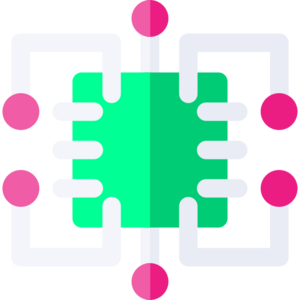

# Mode d'emploi 

**PrimaSTEM** - Complexe pour enseigner aux enfants de plus de 4 ans les bases de la logique, de la programmation et des mathématiques.

## Que contient le kit?

- Robot de jeu

- Panneau de contrôle

- Puces de commande et de valeur

- Chargeur 2xUSB - USB-C

- Manuel d'instruction et guide de l'enseignant (à partir du lien sur primastem.com)

- Terrain de jeu

> les versions et le matériel supplémentaire sont susceptibles d'être modifiés.

### Robot de jeu.

Selon la configuration, l'apparence du robot peut varier légèrement, mais la fonctionnalité de base est la même : le robot exécute les commandes du programme transmises par la télécommande tout en se déplaçant sur une surface horizontale. 

Au centre du robot, il est possible d'installer un marqueur d'un diamètre inférieur à 10 mm pour dessiner des figures géométriques simples tout en se déplaçant.

Le robot dispose d'un bouton d'alimentation, de voyants lumineux, d'un bouton de commande et d'un connecteur USB-C pour recharger la batterie intégrée.

### Panneau de contrôle.

Le panneau de commande est la partie principale du complexe matériel. Sur le panneau supérieur, il y a 11 cellules doubles pour le réglage des puces de commande et de valeur, 6 dans la partie supérieure et 5 dans la partie inférieure. Le panneau de commande est divisé en deux parties fonctionnelles : la partie supérieure, principale - partie des cellules pour le réglage du programme principal et la partie inférieure pour le réglage du sous-programme (fonction).

La télécommande comporte deux boutons : à gauche, le bouton d'alimentation, à droite, le bouton "Run / Stop" qui permet de transférer le programme au robot de jeu et d'arrêter le programme en cours d'exécution.

Après avoir placé les puces de commande et les valeurs dans les cellules de la télécommande, vous devez appuyer sur le bouton "Exécuter" et le robot commencera à exécuter le programme. L'exécution des commandes en cours est signalée par des LED multicolores situées entre les cases de placement des puces et des valeurs de commande.

Si une puce est mal réglée, la télécommande le signale en allumant la LED rouge, mais le programme continue à s'exécuter en ignorant la commande erronée (par exemple, si l'on règle une puce de valeur numérique sans la commande principale).

La télécommande dispose d'un connecteur USB-C pour recharger la batterie intégrée.

### Puces de commandement et de valeur.

L'ensemble comprend des jetons pour créer un programme, ce sont des éléments du code du programme, ils sont installés dans les cellules de la console. Chaque jeton est une commande, il porte une signification strictement définie et non ambiguë (instruction). En plaçant les blocs dans une certaine séquence, vous ordonnez au robot de se déplacer de la manière que vous avez prévue.

> Les compteurs sont divisés en compteurs de commandes et compteurs de valeurs :

#### Puces d'équipe.

Les puces de commande, ce sont les blocs de base pour composer le code - le programme de contrôle du robot.

- “Avance” - avance (10 cm par défaut, pas de réglage numérique)

- ”Droite" - rotation (90 degrés dans le sens des aiguilles d'une montre par défaut, pas de réglage de la valeur numérique)

- ”Gauche" - rotation (90 degrés dans le sens antihoraire par défaut, pas de réglage numérique valeur)

- "Fonction" - exécuter un sous-programme au bas de la télécommande

- "Mouvement aléatoire" - le robot se déplace de manière aléatoire d'un pas logique “Avant”, “Gauche” ou “Droite” (10 cm par défaut, sans valeur numérique)

- "Retour" - reculer (de 10 cm par défaut, sans valeur numérique)

#### Répétition (cycles) et jetons de valeur.

En plus des puces de commande, il existe des puces de répétition (cycles) et de valeurs numériques, qui permettent soit d'exécuter la commande plusieurs fois lorsqu'elles sont placées sous la cellule avec une puce de commande (ce que l'on appelle un cycle), soit d'étendre la fonctionnalité de la commande - par exemple, pour effectuer un virage à un angle autre que 90 degrés ou pour modifier la distance à parcourir pour aller de l'avant.

Les jetons de répétition de base sont représentés par des valeurs de 2 à 6 (selon le nombre de points marqués sur les jetons), ainsi que par des icônes de cycles de répétition avec une valeur numérique à l'intérieur.

Un jeton portant le symbole "Game Dice" indique un nombre aléatoire de répétitions : lorsqu'il est activé, un nombre aléatoire compris entre 1 et 6 inclus est sélectionné.

Les jetons angles et distances sont représentés par les angles de base de 30, 36 et 45 degrés, ainsi que leurs multiples de 60, 72, etc. Les valeurs d'angle sont mesurées en degrés, les valeurs de distance en millimètres, par défaut sans le paramètre l'angle est de 90 degrés, la trajectoire vers l'avant est de 100 millimètres (10 centimètres).

## Connexion de la télécommande et du robot.

Pour connecter la télécommande et le robot, il est souhaitable de veiller à l'ordre d'allumage: il est recommandé d'allumer d'abord le robot et ensuite la télécommande.

Après avoir allumé le robot, placez-le sur une surface horizontale et ne le bougez pas tant qu'il n'est pas connecté à la télécommande - les LED de la télécommande et du robot s'allument en blanc après la connexion (à ce moment, le gyroscope est calibré pour un mouvement rectiligne et des angles de rotation précis).

S'il n'y a pas de connexion, la télécommande et le robot le signalent par des LED rouges clignotantes.

Vérifiez que la télécommande et le robot "s'entendent" en plaçant une puce de mouvement, par exemple "Avant", dans la rangée supérieure de la télécommande et appuyez sur le bouton "Exécuter".

En cas de problèmes de connexion, essayez d'éteindre et de rallumer le robot, puis la télécommande, et rechargez les piles si nécessaire. Vous pouvez perdre la connexion si la télécommande ou le robot est en contact étroit avec un appareil qui émet de fortes radiations électromagnétiques, tel qu'un téléphone portable ou un point d'accès Wi-Fi.

!> Après la mise à jour du logiciel des appareils, il peut être nécessaire d'appairer la télécommande et le robot. Pour ce faire, allumez le robot, puis la télécommande, appuyez sur le bouton "Exécuter" de la télécommande et maintenez-le enfoncé pendant 10 à 15 secondes.

## Comment ça marche?

L'enfant place des puces de commande (avant, gauche, droite, fonction, mouvement aléatoire, etc.) dans les cellules de la console, chacune d'entre elles indiquant l'action requise pour le robot. En outre, il est possible de définir des valeurs numériques pour les commandes et le nombre de répétitions de la commande (de 2x à 6 et un nombre aléatoire ou des valeurs d'angles, de distances, d'opérations arithmétiques).

Les cellules de réglage du bloc de puces commande-valeur sont reliées entre elles de manière intuitive par un "pont" dans lequel se trouve une LED d'indication.

Les commandes sont d'abord définies dans la partie supérieure du panneau de contrôle (6 cellules), elles sont exécutées de gauche à droite, étape par étape, dans l'ordre de priorité, en ignorant les cellules vides ou les cellules avec des commandes définies de manière erronée (par exemple, 2 commandes de contrôle dans un bloc ou 2 commandes de valeur).

La séquence des blocs détermine le programme de déplacement du robot. 

Une fois les blocs de commandes et de valeurs définis, en appuyant sur le bouton droit "**Exécuter**" de la carte de commande, le robot se déplace en suivant la trajectoire définie par le programme.

Par défaut, en exécutant la commande "Forward", le robot se déplace de 10 centimètres, en exécutant les commandes "Left" et "Right", le robot tourne de 90 degrés dans la direction souhaitée. En paramétrant les jetons de répétition (cycle) en plus des commandes fonctionnelles, le robot exécute la commande le nombre de fois requis.

Lorsque le jeton "Fonction" est activé, le sous-programme défini dans la partie inférieure de la console (5 cellules inférieures) est exécuté.

Le pupitre de commande offre la possibilité d'appeler le cycle du programme, c'est-à-dire d'appeler le sous-programme plusieurs fois, en insérant la puce de répétition (cycle) en plus de la commande de la puce "Fonction".

**Fonctions importantes :**

- L'exécution du programme peut être interrompue sans attendre la fin de l'exécution en appuyant à nouveau sur le bouton "Exécuter" lorsque le robot est en mouvement.

- La console garde en mémoire la dernière valeur numérique définie pour les commandes de mouvement (distance ou angle de rotation) jusqu'à ce qu'elle soit éteinte (réinitialisée) : par exemple, si la valeur 150 est définie pour la commande "Forward", toutes les autres commandes "forward" définies dans le programme seront également exécutées avec la valeur 150 (c'est-à-dire 150 mm. = 15 cm). Cette fonction peut être utilisée pour modifier le pas "par défaut" lors de l'utilisation d'une carte de jeu dont les carrés ne sont pas égaux à 10 cm. Lors de la modification d'une valeur numérique à l'aide de jetons d'opérations arithmétiques, le résultat de l'action est également sauvegardé.

- La distance de mouvement "par défaut" (pour l'utilisation de cartes avec des cellules de 12,5 cm, 15 cm et toute autre valeur) peut être modifiée à l'aide de la puce de service spéciale "Distance". Pour modifier la valeur de la distance de mouvement "par défaut", vous devez régler la puce "Distance" avec la valeur requise : par exemple 125 pour 12,5 cm ou 150 pour 15 cm (sans valeur numérique, la distance est réglée sur la valeur standard). (Sans valeur numérique, la distance est réglée sur la valeur standard de 10 cm). La valeur réglée est conservée même après la mise hors tension de l'appareil.

- Après la mise à jour du logiciel de l'appareil, il peut être nécessaire de calibrer le gyroscope et la longueur de mouvement "par défaut" du robot:
  - a. Pour calibrer le gyroscope, mettez le robot sous tension et placez-le sur une surface horizontale. Définissez une puce de service spécial "Calibration" dans la télécommande et appuyez sur le bouton "Exécuter".
  - b. Pour calibrer la distance, mesurez avec précision la distance parcourue par le robot à la commande "Go" (généralement un peu moins ou un peu plus de 100 mm). Placez la puce "Calibrate" dans la télécommande ainsi que la puce numérique dont la valeur est la plus proche possible de la valeur mesurée précédemment et appuyez sur le bouton "Execute". Il est également possible d'écrire la valeur exacte sur n'importe quelle puce numérique NFC à l'aide d'un téléphone portable dans un champ de texte sous la forme nXXX, où XXX est la valeur en millimètres, par exemple n095. Après avoir exécuté la commande "Calibrer" avec le numéro, le robot se déplacera d'exactement 100 mm.

?> Veuillez vous référer au Guide de l'enseignant pour des informations détaillées sur les fonctionnalités avancées.

## Important!

Attention, le jeu n'est pas destiné aux enfants de moins de 4 ans. Contient de petites pièces, risque d'étouffement. La mise en marche, l'installation et l'utilisation à l'intérieur doivent se faire sous la surveillance d'un adulte.

Le jouet utilise des batteries Li-ion. Les batteries ne doivent être chargées que sous la surveillance d'un adulte à l'aide d'un chargeur avec une sortie USB 5V standard et un cordon USB-C.

Les batteries doivent être chargées soit 1 à 2 heures avant la leçon, soit après la leçon. Charger la télécommande et le robot pendant 1 heure est généralement suffisant pour 1 à 2 leçons, une charge complète (dans les 2 à 3 heures) est suffisante pour 3 leçons de 30 à 45 minutes. La capacité et l'autonomie de la batterie peuvent diminuer avec le temps. Il est possible de les remplacer par de nouvelles batteries Li-ion 16340.

La télécommande et le robot s'éteignent automatiquement lorsqu'ils sont inactifs pendant 10 minutes afin d'éviter de consommer inutilement l'énergie de la batterie.

Lorsqu'il est inactif pendant 1 à 3 minutes, le robot effectue de petits mouvements et tourne, signalant qu'il fonctionne et qu'il est prêt pour le programme.

N'ouvrez pas vous-même la télécommande et le robot, si les piles se cassent ou doivent être remplacées, contactez votre revendeur pour obtenir des conseils ou une réparation.

Si l'appareil n'est pas utilisé pendant une longue période, il est recommandé de recharger les piles une fois tous les 2 ou 3 mois, car si le niveau de charge diminue de façon critique, les piles tomberont en panne sans possibilité de récupération, et il faudra les remplacer.

Le complexe est conçu pour fonctionner et être stocké dans un local sec et chaud, chauffé et ventilé, dont la température est comprise entre +10 et +30 degrés Celsius et l'humidité relative entre 45 et 60 %, dans des conditions climatiques artificiellement régulées, par exemple dans des locaux fermés, chauffés ou refroidis et ventilés (pas d'exposition au rayonnement solaire direct, aux précipitations, au vent, au sable et à la poussière de l'air extérieur ; pas d'exposition ou exposition très réduite au rayonnement solaire diffus et à la condensation de l'humidité). La console et le robot de jeu ne doivent pas être exposés à l'humidité.

Protéger la console et le robot des chutes, des chocs et des vibrations excessives.

Le produit doit être transporté et stocké dans l'emballage du fabricant à une température ambiante de +5°C à 40°C avec des précautions contre les dommages mécaniques et les précipitations atmosphériques.