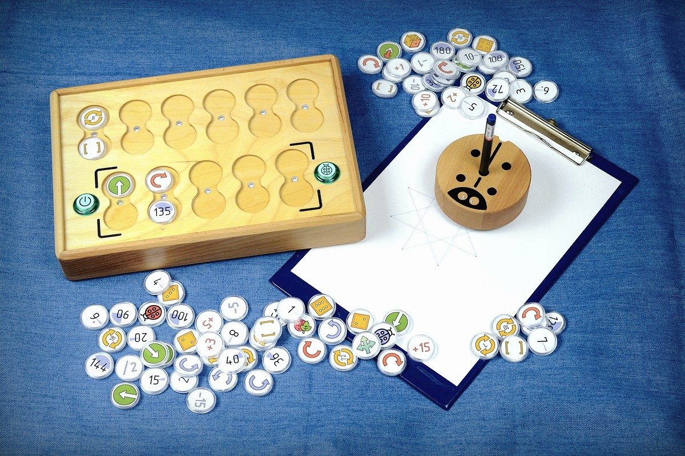
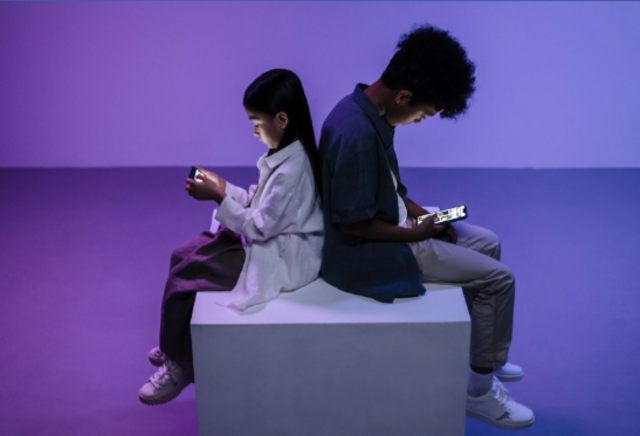
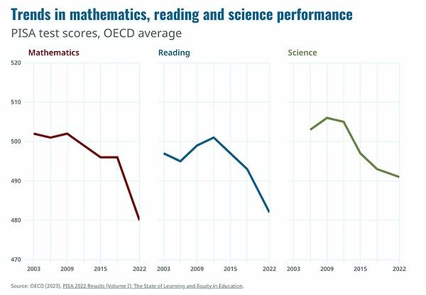

# Введение

**PrimaSTEM** - Инструмент для обучения детей 4+ основам программирования, логики и математики без использования устройств с экраном.

*Пульт управления для создания программы, программные блоки, робот и результаты выполнения кода.*

> 📊 [Презентация для B2B](https://pitch.com/v/primastem_b2b_fr-w5yrm2), фр. язык

## Что происходит?

**Современные дети** с раннего возраста интересуются видеоиграми и электронными устройствами и **быстро учатся**.

Большинство родителей понимают **важность информационных технологий** для успехов их детей в школе и получения востребованной профессии в будущем.

Однако **родители обеспокоены** балансом между обучением **детей** и их **здоровьем**.

В последние годы раннее воздействие экранов ассоциируется со снижением когнитивных способностей и успеваемости в школе. **

** *Программа международной оценки успеваимости студентов (PISA) [2022 Results (Volume I)](https://www.oecd-ilibrary.org/education/pisa-2022-results-volume-i_53f23881-en)*

Использование **экранных устройств** для игр и обучения детей младшего возраста **приводит к**

- психологическим расстройствам,
- зависимости от виртуального мира - игровая зависимость,
- ухудшению зрения и физического здоровья.

## Для чего это нужно?

Это игровой **инструмент преподавателя для обучения детей** в возрасте от 4 лет основам программирования, логики и математики **без использования электронных устройств с экранами**.

Другими словами, это инструмент для обучения таким понятиям, как:
- числа 
- направление в пространстве 
- алгоритмы 
- логика 
- основы программирования 
- арифметические действия и прогрессии 
- геометрия

**Преимущества:**

- многофункциональное, универсальное обучение
- привлекательный процесс обучения для детей
- без экранов и электронных устройств
- с 4 лет и до начальной школы включительно
- натуральные материалы для корпуса
- инновационное техническое решение на основе технологии NFC и Bluetooth

> 🎯 **Основная цель обучения** - развитие когнитивных навыков путем материализации и визуального представления процессов программирования и понимания смысла их результатов.

## Как это работает?

**Это короткое видео - 6-минутная презентация** *(есть русские субтитры)*, она пройдёт быстро и интересно, всё будет двигаться, рисовать и рассказывать о функционале - [youtu.be/Ztq_I1WBiVo](https://youtu.be/Ztq_I1WBiVo)

<iframe src="https://www.youtube.com/embed/Ztq_I1WBiVo?si=ZNSLpsCC8WlPB671" width=100% height="315" title="YouTube video player" frameborder="0" allow="accelerometer; autoplay; clipboard-write; encrypted-media; gyroscope; picture-in-picture; web-share" referrerpolicy="strict-origin-when-cross-origin" allowfullscreen></iframe>

Математический рисунок с использованием переменной и отрицательных чисел. - [youtu.be/6Zoyku27mO8](https://youtu.be/6Zoyku27mO8) 

<iframe src="https://www.youtube.com/embed/6Zoyku27mO8?si=WYYMKyV7d768DI-D" width=100% height="315" title="YouTube video player" frameborder="0" allow="accelerometer; autoplay; clipboard-write; encrypted-media; gyroscope; picture-in-picture; web-share" referrerpolicy="strict-origin-when-cross-origin" allowfullscreen></iframe>

Математический рисунок сердца. - [youtu.be/VgiWu200EGw](https://youtu.be/VgiWu200EGw) 

<iframe src="https://www.youtube.com/embed/VgiWu200EGw?si=EiQKbP0egmZ2aXCa" width=100% height="315" title="YouTube video player" frameborder="0" allow="accelerometer; autoplay; clipboard-write; encrypted-media; gyroscope; picture-in-picture; web-share" referrerpolicy="strict-origin-when-cross-origin" allowfullscreen></iframe>

> 📺  Больше видео на канале **YouTube** -  [youtube.com/@primastem](https://www.youtube.com/@primastem)

## Для кого это?

Конечно это явно предназначено для детей, они используют это для игры, но на самом деле это гибкий инструмент для учителя, который может использовать игровые задания для преподавания самых разных предметов: от математики и программирования до физики, истории и географии, и все ограничивается только мастерством и воображением учителя.

Ребенок приобретает математическую и алгоритмическую базу, которая является подготовкой к школе и первым шагом перед освоением программирования на компьютере в Scratch, Logo или Minecraft.

*Пример результата выполнения программы для рисования спирали с использованием динамического увеличения переменных в цикле.*

## Что дальше?

**PrimaSTEM - это наша попытка создать что-то нужное людям, осязаемое и красивое.**

Сейчас мы ищем партнеров для запуска проекта во Франции и работаем над привлечением инвестиций, открытием офиса и производством в ЕС. Мы готовы к сотрудничеству и партнерству.
