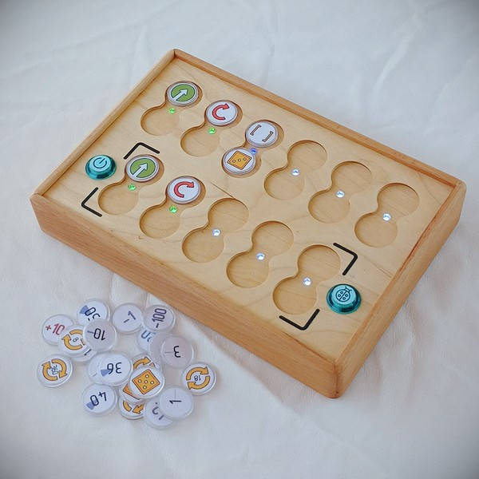

# Инструкция по использованию

**PrimaSTEM** - Комплекс для обучения детей 4+ основам логики, программирования и математики.

## Что входит в состав набора?

- Игровой робот

- Пульт управления роботом

- Фишки команд и значений

- Зарядное устройство 2хUSB - 2A с двумя шнурами USB-C

- Инструкция по эксплуатации и руководство для преподавателя (по ссылке на сайте primastem.com)

- Игровое поле

> Варианты исполнения и дополнительной комплектации могут меняться.

### Игровой робот.

В зависимости от комплектации внешний вид робота может незначительно меняться, но основной функционал сохраняется: робот выполняет команды программы переданной с пульта управления двигаясь по горизонтальной поверхности. 

В центр робота можно установить маркер диаметром менее 10 мм. для возможности рисования простых геометрических фигур во время движения.

У робота есть кнопка включения, светодиоды индикации, кнопка управления и разъем USB-C для подзарядки встроенного аккумулятора.

### Пульт управления.

Пульт управления - главная часть аппаратного комплекса, на верхней панели расположено 11 сдвоенных ячеек для установки фишек команд и значений, 6 в верхней части и 5 в нижней части. Пульт разделён на 2 функциональные части: верхняя, основная часть - часть ячеек для установки главной программы и нижняя часть для установки подпрограммы (функции).

На пульте управления две кнопки: слева расположена кнопка включения, справа кнопка “Выполнить / Остановить” для передачи программы игровому роботу и остановки программы в процессе выполнения.

После установки NFC фишек команд и значений в ячейки пульта необходимо нажать кнопку “Выполнить” и робот начнет выполнять программу. Выполнение текущих команд подсвечивается многоцветными светодиодами расположенными между ячейками для установки фишек команд и значений.

При ошибочной установке фишки пульт проинформирует об этом загоранием красного светодиода, но программа продолжит выполнение игнорируя ошибочную команду (например при установке цифровой фишки значения без основной команды).

На пульте управления имеется разъём USB-C для подзарядки встроенного аккумулятора.

### Фишки команд и значений.

В состав набора входят фишки для создания программы, это элементы программного кода, они устанавливаются в ячейки пульта. Каждая фишка это команда, она несёт в себе однозначное строго определённое значение (инструкцию). Выставляя блоки в определённой последовательности, вы даёте задание роботу двигаться именно так, как вы задумали.

> Фишки делятся на фишки команд и фишки значений:

#### Фишки команд.

Фишки команд, это основные блоки для составления кода - программы управления роботом.

- “**Вперед**” - движение вперед (на 10 см. по умолчанию, без установки цифрового значения)

- “**Вправо**” - поворот (на 90 градусов по часовой стрелке по умолчанию, без установки цифрового значения)

- “**Влево**” - поворот (на 90 градусов против часовой стрелки по умолчанию, без установки цифрового значения)

- “**Функция**” - выполнения подпрограммы в нижней части пульта

- “**Случайное движение**” - случайным образом робот движется на 1 логический шаг “Вперёд”, “Влево” или “Вправо” (на расстояние по умолчанию, без установки цифрового значения)

- “**Назад**” - движение назад (на 10 см. по умолчанию, без установки цифрового значения)

#### Фишки повторов(циклов) и значений.

В дополнение к фишкам команд, для расширения функционала, идут фишки повторов (циклов) и числовых значений, позволяющие либо выполнить команду несколько раз при их установке под ячейкой с фишкой-командой (так называемый цикл), либо расширить функционал команды - например выполнить поворот на угол отличный от 90 градусов или изменить расстояние для движения вперёд.

Фишки основных повторов представлены значениями от 2 до 6 (по количеству обозначенных точек на фишках), а также пиктограммами повторов-циклов с числовым  значением внутри.

Фишка с символом “Игровой кубик” обозначает случайное число повторов: при её установке будет выбрано случайное число из диапазона от 1 до 6 включительно.

Фишки углов и расстояний представлены как основными углами в 30, 36 и 45 градусов, а также их кратными произведениями 60, 72 и т.д. Значения углов измеряются в градусах, значения расстояния в миллиметрах, по умолчанию без параметра угол равен 90 градусам, путь вперёд равен 100 миллиметрам (10 сантиметрам).

## Соединение пульта и робота.

Для соединения пульта и робота желательно обеспечить очередность включения: первым рекомендуется включить робота, а затем пульт.

После включения робота его необходимо поставить на горизонтальную поверхность и не перемещать до момента соединения с пультом - светодиоды на пульте и роботе после соединения загораются белым светом (в этот момент происходит калибровка гироскопа для прямолинейного движения и точных углов поворота).

При отсутствии соединения между собой пульт и робот сигнализируют об этом красным миганием светодиодов.

Проверьте что пульт с роботом “слышат” друг друга установив в верхний ряд пульта любую фишку движения, например “Вперёд” и нажмите кнопку “Выполнить”.

При проблемах с соединением попробуйте выключить-включить робота, затем пульт, при необходимости произведите подзарядку аккумуляторов. Возможна потеря связи при близком контакте пульта или робота с устройством сильного электромагнитного излучения - например с мобильным телефоном или точкой доступа Wi-Fi.

!> После обновления ПО устройств, возможно потребуется **сопряжение пульта и робота**. Для этого необходимо включить робота, затем пульт, нажать и удерживать на пульте 10-15  секунд кнопку "Выполнить".

## Как это работает?

Ребёнок устанавливает в ячейки пульта фишки команд (вперёд, влево, вправо, функция, случайное движение и т.д.), каждая из которых обозначает необходимое действие для робота. Дополнительно можно установить цифровые значения для команд и количество повторов команды (от 2х до 6 и случайное число или значения углов, расстояний, арифметических действий).

Ячейки для установки блока фишек команда-значение интуитивно объединены между собой “мостиком” в котором находится светодиод индикации.

Команды устанавливают в первую очередь в верхнюю часть пульта (6 ячеек), они выполняются слева направо пошагово, в порядке очереди, при этом игнорируются пустые ячейки или ячейки с ошибочно установленными командами (например 2 команды управления в одном блоке или 2 команды значений).

Последовательность расположения блоков определяет программу передвижения робота. 

Когда блоки команд и значений выставлены - нажатие на правую кнопку “**Выполнить**” на пульте-доске приводит робота в движение по заданному программой пути.

По умолчанию, при выполнении команды "**Вперед**" робот проезжает на расстояние 10 сантиметров, при выполнении команд "Влево" и "Вправо" робот поворачивается на 90 градусов в нужную сторону. При установке фишек повтора(цикла)  в дополнение к функциональным командам происходит выполнение команды необходимое количество раз.

При установке фишки "**Функция**" начинает выполняться подпрограмма установленная в нижней части пульта (5 нижних ячеек).

В пульте предусмотрена возможность вызова программного цикла - вызова подпрограммы несколько раз, при дополнительной установке фишки повтор(цикл) к фишке-команде “**Функция**”.

**Важные функции:**

- Выполнение программы можно прервать, не дожидаясь окончания выполнения, повторно нажав кнопку “Выполнить” во время движения робота.

- Пульт запоминает последнее установленное цифровое значение для команд движения (расстояние или угол поворота) до своего выключения (сброса): например при установке к команде “Вперёд” значения 150, все другие установленные в программе команды “вперёд” также будут выполняться с значением 150 (то есть 150 мм. = 15 см).   Эту возможность  можно использовать для изменения шага “по умолчанию” при использовании игровой карты с клетками не равными 10 см. При выполнении изменения цифрового значения с помощью фишек арифметических операций, также сохраняется выполненный результат действия.

- Расстояние движения "по умолчанию" (для использования карт с клетками 12,5 см., 15 см. и любых других значений) можно изменить специальной служебной фишкой "Расстояние". Для изменения значения расстояния движения "по умолчанию" требуется установить фишку "Расстояние" с необходимым значением: например 125 для 12,5 см. или 150 для 15 см. (Без установки цифрового значения, расстояние устанавливается в стандартные 10 см.). Установленное значение сохраняется и после выключения питания устройства.

- После обновления ПО устройства возможно потребуется калибровка гироскопа и длины движения "по умолчанию" для робота: 
  - a. Для калибровки гироскопа необходимо включить и установить робота на горизонтальной поверхности. В пульт установить специальную служебную фишку "Калибровка" и нажать на кнопку "Выполнить".
  - b. Для калибровки расстояния необходимо точно измерить расстояние пройденное роботом по команде "Вперёд" (обычно оно составляет немного менее или немного более 100 мм.). Установить фишку "Калибровка" в пульт, а так же цифровую фишку с максимально близким к измеренному ранее значением и нажать на кнопку "Выполнить". Так же возможно записать точное значение на любую цифровую NFC фишку с помощью мобильного телефона, как текстовое поле в виде nXXX, где XXX это значение в миллиметрах, например n095. После выполнения команды "Калибровка" с числом робот будет двигаться ровно на 100 мм.

?> Подробная информация о расширенном функционале содержится в Руководстве для учителя.

## Важно!

Внимание, набор не предназначен для детей младше 4 лет. Содержит мелкие части, существует опасность удушья. Включение, настройка и эксплуатация в помещении должны производиться под присмотром взрослых.

В игрушке используются Li-ion аккумуляторы.  Аккумуляторы следует заряжать только под присмотром взрослых зарядным устройством с стандартным выходом USB 5V и шнуром USB-C.

Аккумуляторы следует заряжать или за 1-2 часа до урока, или после урока. Заряда пульта и робота по 1 часу обычно хватает на 1-2 урока, полного заряда (в течении 2-3 часов) хватает на 3 урока по 30-45 минут. Емкость и время работы аккумуляторов с течением времени может уменьшиться. Возможна замена на новые стандарта 16340 Li-ion.

Пульт и робот автоматически выключаются при бездействии в течении 10 минут, во избежание лишнего расхода энергии аккумуляторов.

При бездействии от 1 до 3 минут робот выполняет небольшие движения и повороты, сигнализируя о своей работе и готовности к выполнению программы.

Не открывайте сами пульт и робота, при поломке или необходимости замены аккумуляторов свяжитесь с продавцом для консультации или ремонта.

В случае неиспользования набора в течении долгого времени рекомендуется заряжать аккумуляторы раз в 2-3 месяца, при критическом снижении уровня заряда аккумуляторы выходят из строя без возможности восстановления, потребуется их замена.

Комплекс предназначен для эксплуатации и хранения в сухом и теплом помещении, имеющем отопление и вентиляцию, температуру в диапазоне от +10 до +30 градусов по Цельсию и относительную влажность 45–60% с искусственно регулируемыми климатическими условиями, например, в закрытых отапливаемых или охлаждаемых и вентилируемых помещениях (отсутствие воздействия прямого солнечного излучения, атмосферных осадков, ветра, песка и пыли наружного воздуха; отсутствие или существенное уменьшение воздействия рассеянного солнечного излучения и конденсации влаги). Не допускается воздействие влаги на пульт и игрового робота.

Пульт и робота следует оберегать от падений,  ударов и повышенной вибрации.

Транспортировка и хранение изделия должны производиться в упаковке изготовителя при температуре окружающей среды от +5°С до 40°С с соблюдением мер предосторожности от механических повреждений и воздействия атмосферных осадков.

Набор PrimaSTEM предлагает практичный и интерактивный подход к обучению, знакомя детей с концепциями программирования и одновременно стимулируя их творческий ум и чувство логики.