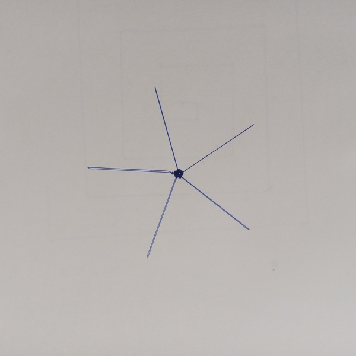

# Примеры математических рисунков

## Простая десятиконечная звезда

| Код | Результат |
| --- | --- |
|  |  |

## Правильный пятиугольник

| Код | Результат |
| --- | --- |
|  |  |

## Простая пятиконечная звезда

| Код | Результат |
| --- | --- |
|  |  |

## Математический рисунок сердца

| Код | Результат |
| --- | --- |
|  |  |

## Треугольник с простой программой

| Код | Результат |
| --- | --- |
|  |  |

## Треугольник с использованием функции

| Код | Результат |
| --- | --- |
|  |  |

## Треугольная спираль

| Код | Результат |
| --- | --- |
|  |  |

## Кривая c отрицательными углами

| Код | Результат |
| --- | --- |
|  |  |

## Квадратная спираль

| Код | Результат |
| --- | --- |
|  |  |

## ~5-минутный таймер

| Код | Результат |
| --- | --- |
|  |  |

## ~1 минутный таймер

| Код | Результат |
| --- | --- |
|  | Робот поворачивается на 36 градусов 10 раз каждые 6 секунд и в конце поворачивается на 360 градусов. |

## Спираль

| Код | Результат |
| --- | --- |
|  |  |