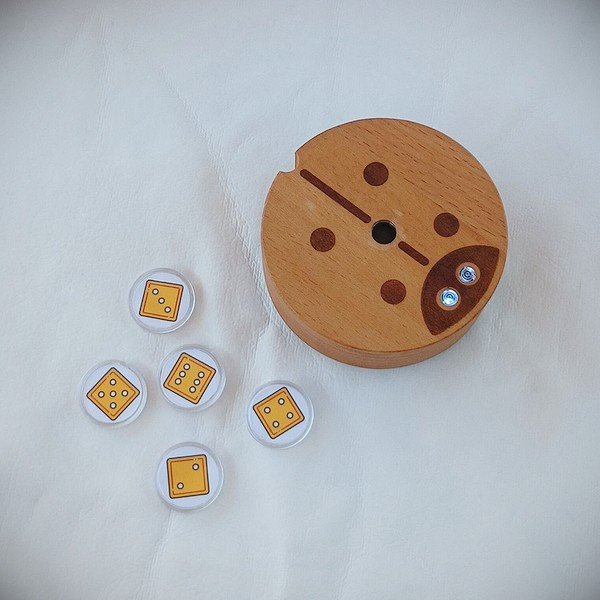
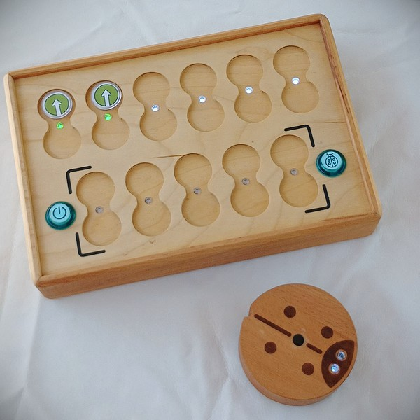

# Руководство для учителя.

Мы, создатели PrimaSTEM, познакомим вас с развивающим образовательным набором для игр и обучению логике, программированию, математике.

PrimaSTEM это игрушка - учебное пособие, которая позволяет детям в возрасте 4 - 10 лет учиться программировать дружелюбного робота без компьютеров, планшетов и телефонов. 

Сложный процесс программирования здесь представлен простым и осязаемо-тактильным, доступным даже самым маленьким детям.  Дети поймут основы  программирования, логики и математики через игру.

PrimaSTEM можно использовать в разных дошкольных и школьных предметах, как в математике, так и например в географии, а также внеклассных развивающих занятиях. Он универсален!

Игра с PrimaSTEM способствует развитию детей в таких ключевых областях, как логическое мышление, алгоритмика, программирование, математика, геометрия, а также творческое и социально-эмоциональное развитие.

Набор PrimaSTEM является первой подготовительной ступенью перед знакомством ребенка с программированием на компьютере в среде блочных языков таких как [Scratch](https://en.wikipedia.org/wiki/Scratch_(programming_language)) или [LOGO](https://en.wikipedia.org/wiki/Logo_(programming_language)).

## Знакомство с обучающим набором

### Как и где можно использовать набор PrimaSTEM?

Ниже представлены образовательные области и программы где возможно использование PrimaSTEM  для обучения детей основам логического мышления и программирования, а также изучения других предметов через тактильный игровой процесс:

- Центры дошкольного обучения

- Детские сады с методиками обучения Монтессори

- Начальная школа

- Домашнее обучение

- Специальные центры обучения для детей с особенностями развития

- Группы школьного образования продлённого дня

- Кружки начального изучения программирования

- Детские образовательные летние лагеря

### Что необходимо знать для начала обучения?

Документ содержит основную техническую информацию об обучающем наборе для начинающего пользователя.

Руководство рекомендовано для изучения преподавателями до начала работы с детьми.

Для обучения детей программированию с представленным набором преподавателю не требуется специальное образование и предварительные навыки кодирования.

## Исследования по теме и ценность набора.

PrimaSTEM  это последователь языка программирования для начинающих - [LOGO](https://en.wikipedia.org/wiki/Logo_(programming_language)), и системы обучения Монтессори. Интерфейс игры специально разработан для детей возраста 4 - 10 лет, поэтому в этой игре много знакомых детям образов, а саму программу можно потрогать, она буквально создаётся руками детей. Возрастная группа 5-6 лет идеально подходит для начала обучению программирования, которое здесь построено, во-первых, без электронных устройств с экранами, а во-вторых,  таким образом, что  привлекает к изучению другие базовые предметы дошкольного образования - счёт, логику, ритмику, окружающий мир, этику, рисование.

Язык LOGO (не путайте с наборами Lego) был важным этапом в образовании для обучения тех, кто только начинает знакомиться с программированием. Цель [Сеймура Паперта](https://en.wikipedia.org/wiki/Seymour_Papert), который создал LOGO в Массачусетском технологическом институте в 1960-х годах, состояла не только в том, чтобы научить программированию, но и помочь детям открыть свой собственный, индивидуальный способ решения задач.

В языке LOGO предусмотрен специальный исполнитель команд - **робот черепашка**. Робот  является тем переходным объектом, который служит своеобразной метафорой, позволяющей превращать опыт телесных манипуляций с фишками-командами и пультом в понятийные обобщения и абстракции.

Наблюдая за поведением робота, можно легко увидеть смысл каждой команды и тем самым освоить не только средства языка программирования, но и легко научиться алгоритмам.

Робот обладает важным качеством: у него есть направление, что позволяет ребенку идентифицировать себя с ним и легче понять основную логику работы программ.

Первоначальные команды очень просты: они указывают в каком именно направлении робот должен перемещаться. Обучение робота "действовать" или "думать" заставляет детей осмысливать собственные действия и мысли, поэтому процесс обучения программированию становится более эффективным.

Фишки-команды PrimaSTEM можно считать упрощением языка LOGO. Мы ограничили основные, базовые инструкции их самой простой формой, избегая любого вида текстового или числового языка в начале обучения.

Выбор материала не случаен: пульт управления PrimaSTEM выполнен из дерева, натурального материала. Во время разработки мы провели наблюдения в детских садах, где увидели, что игрушки и игры из дерева наиболее любимы детьми. Деревянный робот и пульт оставляют на себе следы, потёртости и царапины от игр, тем самым вбирая в себя информацию и делясь ею с детьми. Детям намного приятнее пользоваться игрушкой “с историей”, нежели пластиковыми аналогами.  Древесина также была выбрана в качестве материала корпуса из -за резкого контраста, который она создает с технологией, скрывающей сложность электроники под оболочкой.

## Программирование

Физические, материальные фишки-команды PrimaSTEM имеют аналоги любого реального процедурного языка программирования, и играя дети могут учиться различным основным концепциям программирования и логики.

### Алгоритмы

Алгоритмы - это наборы точных инструкций, которые формируют программу.

Фишки-команды PrimaSTEM это физическое представление инструкций, которые объединяются вместе для создания программы.

### Очередь

Инструкции в программах выполняются в точном порядке одна за одной. На пульте PrimaSTEM они расположены подряд, слева-направо,  также как и физическое представление очереди.

### Исправление ошибок, отладка

Инструкции расположены одна за другой на пульте управления. Исправить ошибки так же легко, как поменять фишку, если робот не приходит туда, где ему нужно. Это называется отладкой программы.

### Функция

Функция (или подпрограмма) в программировании это фрагмент программного кода, к которому можно обратиться из другого места программы. Можно создать подпрограмму, "упаковав" последовательность инструкций в строке функции (нижняя часть пульта управления), и вызвать ее в очереди с помощью оранжевой фишки “**Функция**” (в верхней части пульта), когда вам это нужно.

## Применение для обучения в других предметах

Тактильный и социально-ориентированный характер PrimaSTEM делает из него разносторонний инструмент для обучения. PrimaSTEM помогает  при обучении в других предметах, которые выходят за рамки программирования.

> Использование PrimaSTEM в классе может помочь для развития у детей следующих навыков:

### Общение со сверстниками

Игра учит детей сотрудничеству. Разнообразное взаимодействие с PrimaSTEM в группе развивает у детей коммуникативные навыки. Дети помогают друг другу искать решение задачи и направлять робота в нужном направлении.

### Координация и мелкая моторика

Дети развивают контроль и координацию движений перемещаясь вокруг игрового поля и по нему. Они договариваются о размещении препятствий для робота. Дети запоминают повороты налево и направо и учатся применять их в игре и в жизни. Моторика развивается при размещении фишек на пульте управления нужные в ячейки.

### Социально-эмоциональное развитие

Дети становятся увереннее, пробуя новые виды деятельности. В процессе игры могут возникать ошибки, которые устраняются легко собственными догадками или помощью группы и преподавателя. Таким образом в игре не будет неправильных результатов, т.к. она поощряет групповую работу, и каждый ребенок будет ее частью и успешно выполненного задания. Положительным эмоциям ребенка способствует быстрый и видимый результат его усилий!

### Математика

Для старта робота дети выкладывают фишки команд, считая их, по числу шагов программы робота. Простой счёт закрепляется в процессе игры. Также для достижения роботом намеченной цели дети учатся оценивать расстояние, измерять его количеством шагов, представлять, за сколько команд робот преодолеет его.

Фишки значений позволяют расширить область обучения.  Возможность введения понятия о  случайных числах позволяют даже затронуть тему из раздела теории вероятностей.

### Логическое мышление

Фишки-команд позволяют детям создавать и отлаживать простые программы своими руками. Они целенаправленно используют процесс программирования для создания, организации, хранения, манипулирования и получения решений поставленных задач.

### Творчество и умственное развитие

Также в процессе усложнения программирования у детей будет возможность индивидуально проявиться, составив свое решение задачи. Многие задания предполагают несколько вариантов решений.

!> Ребенок, получив задание или придумав свой план, руками выстаивает последовательную цепочку из фишек команд, он тактильно ощущает их. После нажатия кнопки “**Выполнить**” робот приходит в движение, и ребенок видит результаты своего кода программы. Он делает выводы, правильно ли он направил робота, совпадает ли результат с его первоначальной мыслью. Таким образом один процесс задействует тактильное, зрительное и умственное восприятие ребенком игры.

## Организация игрового процесса обучения

Цель состоит в том, чтобы дети при решении поставленных игровых задач, создавали программы для робота, организуя последовательности инструкций-команд.

Чем больше времени тратится на решение игровых задач с роботом, тем больше дети развивают навыки вычислительного мышления; наблюдая за ними, можно заметить что для решения более сложных задач дети создают более длинные последовательности инструкций или делят программу на несколько логических частей.

Скорость, с которой ребенок может прогрессировать через “трудность задачи”, варьируется от ребенка к ребенку, но всегда важно не пропустить вводные, обучающие шаги, независимо от того, как быстро ребенок проходит их.

Далее в руководстве представлены основные части учебного процесса раскрывающие все возможности и потенциал набора для обучения.

На их основе можно построить учебный процесс курсов основ логики и программирования для различных групп детей, а так-же для других образовательных предметов.

## Знакомство с роботом

Представьте вашим ученикам робота как игрушечного друга, например по имени “**Жужа**”, которого дети могут запрограммировать.

Детям следует сказать, что робот не может думать сам и может двигаться только так, как это запрограммировано ребенком, точно так же, как и любая другая машина.

Если вы проводите обучение в группе, рассадите детей по кругу и позвольте им передавать робота друг другу, здороваясь с ним или просто передавая его из рук в руки и тактильно ощущая его. Это создает своего рода связь с роботом, точно так же, как они сделали бы с обычной игрушкой, и решение задач через рассказы позже станет для детей более важным и более вовлеченным.

Необходимо сообщить детям, что с роботом нужно обращаться бережно, потому что он хрупкий, и внутри него точная электроника, поэтому его нельзя бросать. У робота есть кнопка включения/выключения, покажите детям как включить робота.

## Знакомство с пультом управления

Познакомьте детей с пультом управления, который дети смогут использовать для отправки инструкций в робота. Без этого пульта управления нет никакого способа отправить команды-инструкции для робота.

Важно, чтобы дети понимали, что робот способен двигаться только по команде человека. Это не только понятие возможностей для управления, но и является ключом к пониманию всей вычислительной техники.

Попросите детей также объяснить, какие другие объекты в их домах и жизни функционируют с аналогичной парадигмой. Например, телевизор нуждается в человеке, чтобы поменялся канал, или стиральная машина нуждается в человеке, чтобы выбрать режим для стирки.

Все эти примеры, как и наш робот, являются машинами, которые нуждаются в человеческом программировании для работы и выполнения своей работы.

Необходимо сообщить детям, что на пульт нельзя садиться, вставать ногами, его нельзя бросать и пинать. Пульт работает при включенной кнопке вкл/выкл, покажите детям как включать пульт для работы.

> Стоит заметить, что для создания основной части программы для робота используется только верхний ряд пульта управления (6 ячеек для команд и ячейки под ними для значений). Ячейки в нижней части пульта (5 ячеек для команд и ячейки под ними для значений) предназначены для подпрограммы и активируются при использовании команды “**Функция**”.

## Знакомство с фишками - командами управления

Представьте детям фишки - команды, как инструкции для перемещения робота, когда они вставлены в ячейки пульта управления, и затем нажата кнопка выполнения программы.

Разные фишки-команды означают разные инструкции, и важно, чтобы каждая фишка была понята как однозначная и четкая инструкция для робота.

Эти фишки-команды то, что составляет тактильно осязаемый язык программирования для робота, и являются ключевыми для получения навыков вычислительного мышления. Когда фишка вставляется в пульт, ребенок должен понимать, что робот выполнит, как только команда будет отправлена.

Это ключ к пониманию таких понятий, как проектирование программ и  прогноз действия, это помогает развивать детям абстракцию.

Необходимо сообщить детям, что фишки нельзя разбрасывать, брать в рот, мочить, так как без них робот не сможет получить нужные команды и двигаться.

## Игровой процесс - часть 1 (начальный уровень)

### Причина и следствие

Цель первого урока состоит в том, чтобы ввести простое понятие, что отправка команды в робота приведет к действию. Возьмите зеленую фишку (вперед) и попросите ребенка поставить её в первую левую верхнюю ячейку в пульте управления. Затем попросите ребенка нажать большую кнопку на пульте (Выполнить) и наблюдать, как робот выполняет команду. Убедитесь, что ребенок четко связывает вид фишки с выполняемым действием.

### Однозначные инструкции

Повторите предыдущий шаг с каждой фишкой направления: вперед, поворот влево и поворот вправо, пока ребенок не сможет уверенно распознать каждую фишку как отдельную и однозначную инструкцию для робота. Это важный шаг к пониманию того, как осмысленная цепочка команд или последовательность, может быть позже создана для решения конкретной задачи.

### Первая задача

Разверните карту (или создайте площадку с клетками 10 х 10 сантиметров на ровной поверхности с помощью скотча или маркера) и поместите робота на квадрат.

Попросите ребенка создать программу, которая доставит робота на один квадрат прямо перед ним. Ребенок должен уметь рассуждать и говорить, какая единственная инструкция позволит роботу достичь своей цели. Пусть ребенок вставит фишку в первую верхнюю ячейку пульта и нажмет кнопку действия “Выполнить”.

Если была выбрана неверная фишка, просто верните робота на первоначальную позицию и попросите ребенка порассуждать о своем выборе и попробовать новые варианты.

## Игровой процесс - часть 2 (начальный уровень)

### Очередь событий

На этот раз установите точку прибытия на два квадрата впереди робота, а затем попросите ребенка создать программу с двумя фишками, которая доставит робота к его дому. Пусть ребенок рассуждает и создает последовательность, которая приведет робота к месту назначения.

Пусть ребенок вставит фишки в первые две верхние ячейки пульта управления и нажмет кнопку действия - “**Выполнить**”.  Не беспокойтесь, если была выбрана неверная фишка. Просто верните робота на первоначальную позицию и попросите ребенка порассуждать о своем выборе и попробовать новые варианты.

### Последовательность из трех фишек - команд

На этот раз установите точку прибытия на один квадрат впереди робота и на один квадрат справа от него (или слева). Попросите ребенка создать программу, которая доставит робота к его  дому. Пусть ребенок рассуждает и создаст последовательность, которая приведёт робота к месту назначения.

Пусть ребенок вставит фишки в первые три верхних слота пульта управления и нажмет кнопку “**Выполнить**”.  Не волнуйтесь, если была выбрана неверная фишка. Просто верните робота на первоначальную позицию и попросите ребенка порассуждать о своем выборе и попробовать новые варианты.

### Отладка - нахождение ошибки

Установите точку прибытия на один квадрат впереди робота и на один квадрат слева от него (или справа). 

На этот раз создайте программу для решения проблемы, намеренно вставив неверный поворот в последовательность.

Попросите ребенка предсказать неверную команду в программе и самостоятельно предсказать неверный результат, а также позвольте ему нажать кнопку “**Выполнить**”, чтобы подтвердить свое предположение.

После того, как ребенок убедится в том, что представленная последовательность была неправильной, либо путем рассуждения, либо путем проверки, позвольте ему изменить неправильную команду на правильную, тем самым отлаживая программу.

## Игровой процесс - часть 3 (средний уровень)

### Знакомство с командой “Функция”

После того, как ребенок ознакомится с основными командами и идеей алгоритма, настало время ввести функциональную фишку-команду. Фу́нкция в программировании это повторяемый фрагмент программного кода, к которому можно обратиться из другого места программы.

Чтобы объяснить, как это работает, вы можете использовать метафору башни (под фишкой функции сложены другие команды одна за другой), объясняющую, что можно поместить больше инструкций внутри одной оранжевой фишки.

Чтобы показать это на примере, сначала разместите две зелёных фишки “**Вперёд**” в основные верхние ячейки пульта управления и нажмите кнопку “**Выполнить**”. Это позволит переместить робота вперед на две клетки сетки на карте.

Теперь очистите ячейки пульта и поместите две фишки “**Вперёд**” в функциональную строку пульта (нижние ячейки пульта), а  фишку “Функция” поместите в основную, верхнюю ячейку. Пусть дети заметят, что робот может выполнять одни и те же действия двумя различными последовательностями.

Далее создайте программу для робота: **“Вперёд”-“Вперёд”-”Вправо”-“Вперёд”-“Вперёд”**.

Покажите детям что выполнит робот. Попросите детей найти одинаковые части программы.

Спросите можно ли “спрятать” эти части в “**Функцию**” что бы не делать этих повторов.

Создайте вместе с детьми программу используя возможности команды “Функция”: в верхней части пульта установите команды  **“Функция”-”Вправо”-”Функция”**, а в нижней части пульта (в части для подпрограммы функции) установите команды **“Вперёд”-”Вперёд”**.

Посмотрите с детьми на результат, выделите с ними повторяющиеся части программы и попробуйте с ними повторить действия робота, изменив программу используя команду “**Функция**”.

### Решение задач с помощью “Функции”

Разверните карту, поместите робота на клетку старта и дайте ребенку только следующие фишки: 3 фишки “**Вперёд**” и 2 фишки “**Функция**”.

Попросите ребенка создать программу, которая позволит роботу переместиться вперёд на 5 квадратов. Поскольку для этого недостаточно фишек “**Вперёд**”, ребёнку нужно понять, что для решения этой задачи  нужно использовать вспомогательную функцию. Мы называем её просто “**Функция**”.

Пусть ребенок создаст правильную последовательность, включая функцию, и нажмёт кнопку “**Выполнить**”. Если последовательность неправильна, просто верните робота на первоначальную позицию и попросите ребенка порассуждать о правильном решении задачи и попробовать новые варианты.

## Игровой процесс - часть 4 (продвинутый уровень)

### Знакомство с командой “Случайное направление”

Для введения понятия случайности возьмите 3 фишки направления: “**Вперёд**”, “**Влево**” и “**Вправо**”, поместите их в непрозрачную коробку или мешочек, перемешайте и попросите детей не глядя вытаскивать по 1 фишке и показывать её группе, затем возвращая её назад. Объясните детям что такое случайность из трёх состояний на этом примере.

Затем покажите детям фишку-команду “**Случайное направление**”, можно заметить что своим изображением-пиктограммой она повторяет все три фишки направлений.

Объясните что эта фишка делает тоже самое что они делали до этого вытаскивая случайные фишки из пакета: случайно выбирает 1 из 3-х команд для передачи роботу и затем двигает его на 1 логический шаг - клетку.

Поместите фишку “**Случайная команда**” в верхнюю ячейку пульта и нажмите кнопку Выполнить. Верните робота на первоначальное место. Повторите опыт несколько раз.

Проведите небольшую игру “Что сделает робот?” попросив ребёнка угадать что сделает робот перед тем как он нажмёт кнопку “**Выполнить**”: поедет прямо, повернёт и поедет налево или повернёт и поедет направо.

Акцентируйте внимание на моменте, что это случайность и всегда угадать правильно направление нельзя.

## Игровой процесс - часть 5 (продвинутый уровень)

### Знакомство с параметрами команд - численными циклами

До этого момента ячейки под местами для команд не использовались, настало и для них время. Покажите детям фишки значений, спросите знают ли они числа, видели ли игральный кубик для настольных игр, играли ли они в такие игры.

Поместите две фишки “**Вперёд**” в верхние ячейки пульта и нажмите кнопку “**Выполнить**”. Робот проедет на 2 клетки.

Уберите одну из фишек, под оставшуюся команду поместите команду цикла с цифровым значением 2 (фишка с двумя точками) и нажмите кнопку “**Выполнить**”.

Акцентируйте внимание детей на том что фишкой с 2 точками мы заменили повторяющиеся команды в очереди, то есть сделали повтор (цикл).

Установите 3, затем 4 команды “**Вперёд**”, нажмите кнопку “**Выполнить**”, а затем попросите детей с помощью фишек значений повторить движение робота на 4 клетки. Возможны как простые варианты решения задач с установкой фишки “**Вперёд**” и значения цикла 4, а также другие варианты, например “**Вперёд**” с числом цикла 3 и ещё одна команда “**Вперёд**” и т.д.

### Цикл (повтор) вызова “Функции” несколько раз подряд

Попробуйте с детьми применить Цикл с значениями к команде “Функция” например заставив робота ходить зигзагом с помощью установленной команды “Функция” с значением цикла 5 и функциональной последовательности в нижней части пульта из команд “**Вперед**”, “**Вправо**”, “**Вперёд**”, “**Влево**”.

Вначале создайте с помощью функции программу для движения “по ступеньке” и выполните её.

Затем добавьте к функции Цикл с числом 5, тем самым повторив функцию несколько раз.

После нажатия кнопки “**Выполнить**” робот поедет лесенкой по диагонали вправо и вверх, сделав по пути следования 5 ступеней, объясните детям что повтор “**Функции**” несколько раз подряд называется циклом функции, и используется для повтора в программе несколько раз определённой последовательности различных команд.

## Игровой процесс - часть 6 (продвинутый уровень)

### Знакомство с понятием случайное число

По аналогии с “**Случайное движение**” среди фишек циклов существует фишка “**Случайное число циклов**”, обозначена символом игрального кубика. Фишка может принимать случайные значения цифровых фишек повтора-цикла: от 1 до 6.

Для введения понятия случайного числа возьмите 4 фишки значений: “**2**”, “**3**”, “**4**” и “**5**”, поместите их в непрозрачную коробку или мешочек, перемешайте и попросите детей не глядя вытаскивать по 1 фишке и показывать её классу, называя значения, затем возвращая её назад. Проведите игру, кто вытащит большее значение. Объясните детям что такое случайность из четырёх состояний на этом примере.

Затем покажите детям фишку-значение “**Случайное число циклов**”. Объясните что эта фишка делает почти тоже самое что они делали до этого, вытаскивая случайные фишки значений из пакета: случайно выбирает 1 из 6 чисел (от 1 до 6) для передачи роботу и повтора действий.

Поместите фишку “**Вперёд**” в верхнюю ячейку пульта, а фишку “**Случайное число циклов**” под ней. Попросите детей нажать кнопку “**Выполнить**”. Верните робота на первоначальное место. Повторите эту задачу несколько раз.

Проведите небольшую игру разбив детей на 2 команды “Чей робот уедет дальше?”.

Обратите внимание детей на то, что робот перемещается на случайное количество клеток: от 1 до 6. Акцентируйте внимание на моменте, что это случайность и заранее узнать как далеко проедет робот нельзя.

## Фантазируйте вместе с детьми!

Только вы лучше всего знаете своих учеников и как с ними работать. Только от вас зависит развитие детей и их образование. PrimaSTEM является универсальным инструментом для обучения детей в игровой форме не только логике и программированию, но и другим предметам, используйте его гибкость и универсальность для создания игровой среды. Всё зависит только от вашей фантазии!

> Спасибо за использование PrimaSTEM в вашем учебном процессе или за проявленный интерес к комплексу!

Мы очень надеемся на обратную связь и отзывы, пожалуйста напишите нам об опыте использования.
